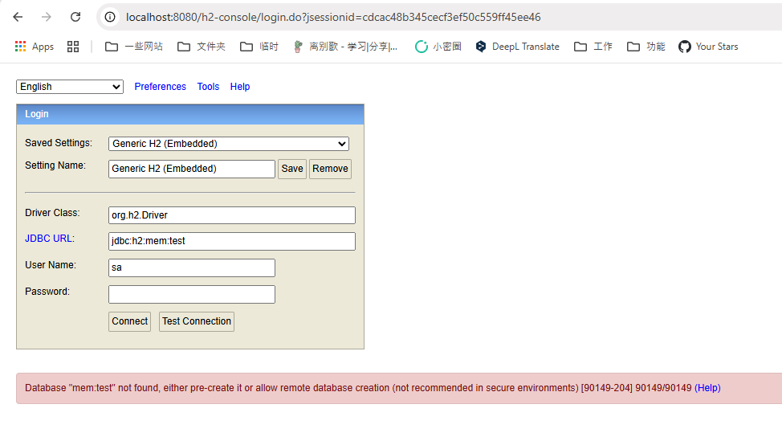
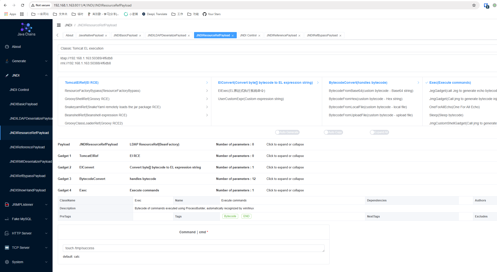
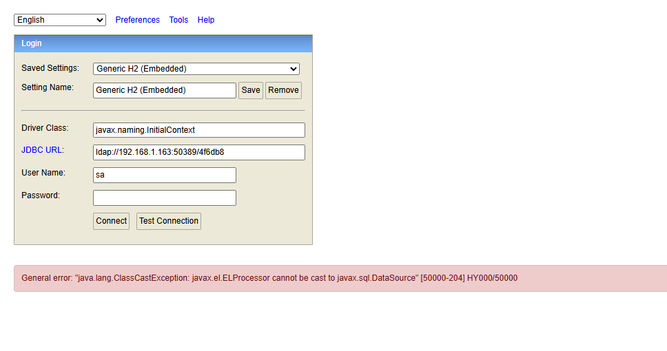
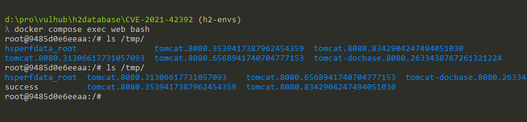

# H2 Database Web 控制台未授权 JNDI 注入 RCE 漏洞（CVE-2021-42392）

H2 Database 是一个快速、开源的基于 Java 的关系型数据库管理系统（RDBMS），可用于嵌入式（集成在 Java 应用中）和客户端 - 服务器模式。

当 Spring Boot 集成 H2 Database 时，如果设置如下选项，将会启用 Web 管理页面：

```
spring.h2.console.enabled=true
spring.h2.console.settings.web-allow-others=true
```

1.4.206 之前版本的 H2 Database 管理页面支持通过 JNDI 加载 JDBC 驱动，攻击者可以利用 JNDI 注入实现远程代码执行。

参考链接：

- <https://jfrog.com/blog/the-jndi-strikes-back-unauthenticated-rce-in-h2-database-console/>
- <https://mp.weixin.qq.com/s?__biz=MzI2NTM1MjQ3OA==&mid=2247483658&idx=1&sn=584710da0fbe56c1246755147bcec48e>
- <https://github.com/h2database/h2database/commit/b24aa46f48904ce64443f8f4353d70a2eed09037>
- <https://github.com/h2database/h2database/security/advisories/GHSA-h376-j262-vhq6>

## 环境搭建

执行如下命令启动一个集成了 H2 Database 2.0.204 版本的 Spring Boot：

```
docker compose up -d
```

容器启动后，Spring Boot 服务监听在 `http://your-ip:8080`，H2 管理页面默认地址为 `http://your-ip:8080/h2-console/`。

## 漏洞复现

在复现本漏洞前，可以先确认 [CVE-2018-10054](../CVE-2018-10054) 中的 payload 已无法利用，因为 1.4.197 之后内存数据库被禁用：



1.4.197 之后的 H2 控制台新增了 [`-ifNotExists` 选项](https://github.com/h2database/h2database/pull/1726)，默认禁用远程数据库创建。因此，攻击者无法通过未知数据库文件（如内存数据库）进入 H2 控制台。

但 H2 控制台依然支持 [JNDI 注入](https://www.veracode.com/blog/research/exploiting-jndi-injections-java)，可用于执行任意代码。

我们可以直接使用 [Java-Chains](https://github.com/vulhub/java-chains) 来利用该漏洞。首先，使用 `JNDI/JNDIResourceRefPayload` 模块生成恶意 JNDI URL（记得填写你想执行的命令）：



然后，访问 H2 Web 控制台登录页，将 Driver class 填写为 `javax.naming.InitialContext`，JDBC URL 填写为 Java-Chains 生成的 JNDI URL：



如图所示，命令已被成功执行：


