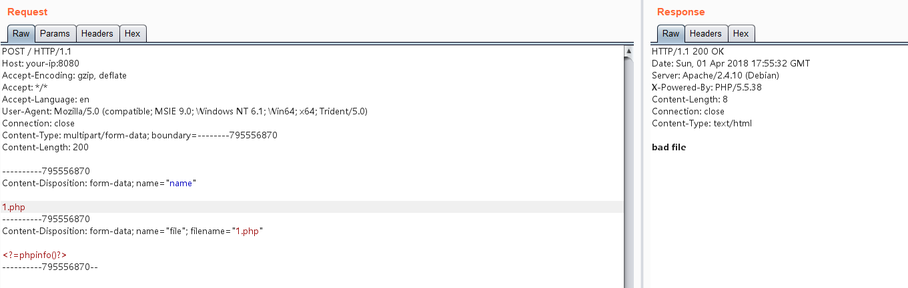
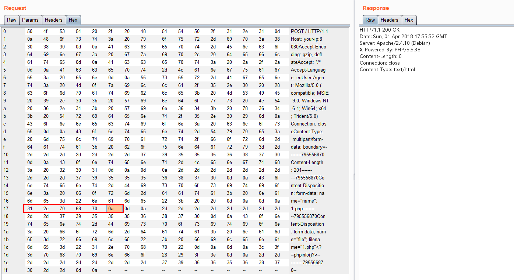
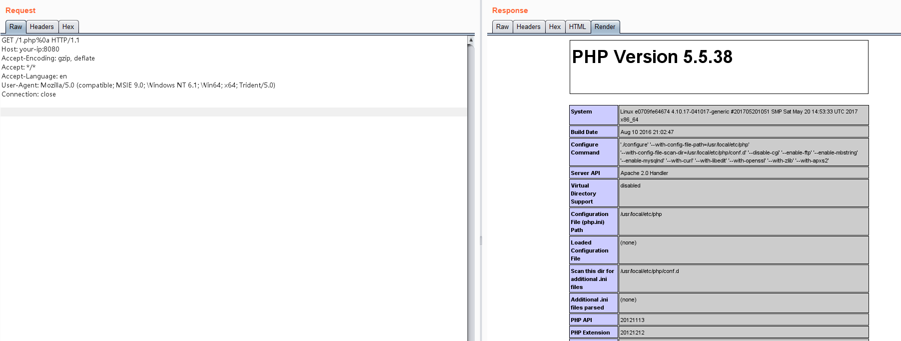

# Apache HTTPD 换行解析漏洞（CVE-2017-15715）

Apache HTTPD是一款HTTP服务器，它可以通过mod_php来运行PHP网页。其2.4.0~2.4.29版本中存在一个解析漏洞，在解析PHP时，`1.php\x0A`将被按照PHP后缀进行解析，导致绕过一些服务器的安全策略。

## 漏洞环境

编译及运行漏洞环境：

```
docker-compose build
docker-compose up -d
```

启动后Apache运行在`http://your-ip:8080`。

## 漏洞复现

上传一个名为1.php的文件，被拦截：



在1.php后面插入一个`\x0A`（注意，不能是`\x0D\x0A`，只能是一个`\x0A`），不再拦截：



访问刚才上传的`/1.php%0a`，发现能够成功解析，但这个文件不是php后缀，说明目标存在解析漏洞：


