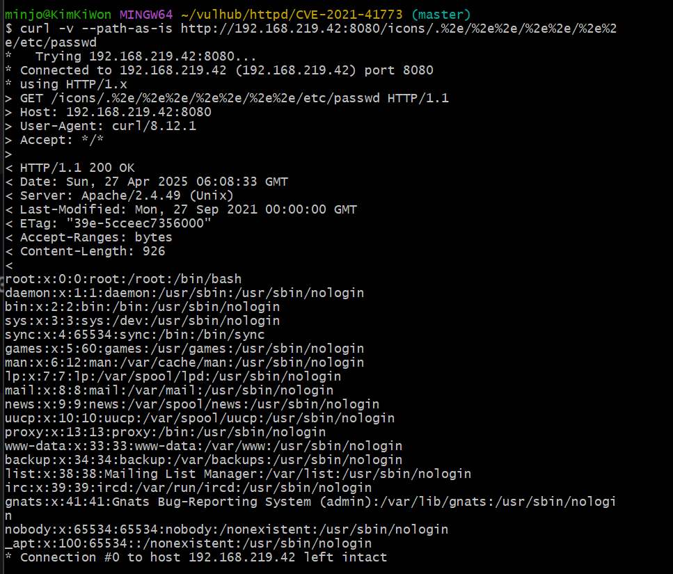
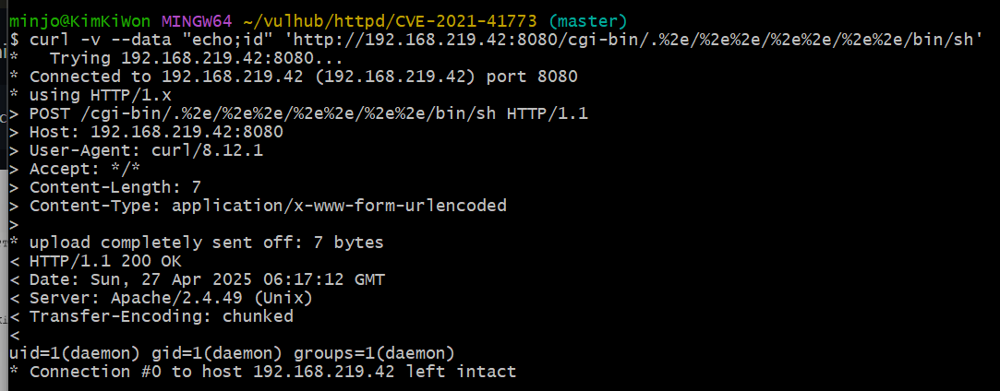

# Apache HTTP Server 2.4.49에서 경로 우회로 인한 파일 유출 취약점 발생 | CVE-2021-41773

> 화이트햇스쿨 3기 17반 - [김기원 (@kimkiw0n)](https://github.com/kimkiw0n)

<br/>

## 요약
- Apache HTTP Server 프로젝트는 UNIX와 Windows를 포함한 최신 운영체제용 오픈소스 HTTP 서버를 개발하고 유지하는 것을 목표로 하는 프로젝트입니다.

- Apache HTTP Server 2.4.49 버전에서 경로(normalization) 처리 방식이 변경되면서 취약점이 발견되었습니다. 공격자는 경로 탐색(Path Traversal) 공격을 통해, 원래 접근이 허용되지 않은 문서 루트(document root) 외부 파일에 접근할 수 있습니다.

- 이때, 기본 설정인 "require all denied"가 적용되지 않은 디렉터리에 있는 파일이라면 공격자가 요청을 성공시킬 수 있습니다. 또한, 해당 경로에 대해 CGI 스크립트 실행이 허용되어 있을 경우, 원격 코드 실행(Remote Code Execution, RCE)까지 발생할 수 있습니다.

<br/>

## 환경 구성 및 실행
```bash
docker-compose up -d
docker ps
```
<br/>


<br/>

