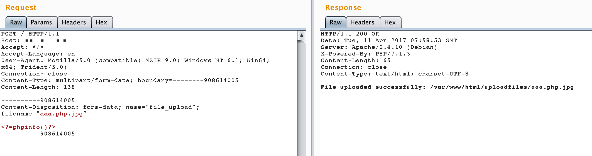

# Apache HTTPD 多后缀解析漏洞

Apache HTTPD 支持一个文件拥有多个后缀，并为不同后缀执行不同的指令。比如，如下配置文件：

```
AddType text/html .html
AddLanguage zh-CN .cn
```

其给`.html`后缀增加了media-type，值为`text/html`；给`.cn`后缀增加了语言，值为`zh-CN`。此时，如果用户请求文件`index.cn.html`，他将返回一个中文的html页面。

以上就是Apache多后缀的特性。如果运维人员给`.php`后缀增加了处理器：

```
AddHandler application/x-httpd-php .php
```

那么，在有多个后缀的情况下，只要一个文件含有`.php`后缀的文件即将被识别成PHP文件，没必要是最后一个后缀。利用这个特性，将会造成一个可以绕过上传白名单的解析漏洞。

## 漏洞环境

运行如下命令启动一个稳定版Apache，并附带PHP 7.3环境：

```
docker-compose up -d
```

## 漏洞复现

环境运行后，访问`http://your-ip/uploadfiles/apache.php.jpeg`即可发现，phpinfo被执行了，该文件被解析为php脚本。

`http://your-ip/index.php`中是一个白名单检查文件后缀的上传组件，上传完成后并未重命名。我们可以通过上传文件名为`xxx.php.jpg`或`xxx.php.jpeg`的文件，利用Apache解析漏洞进行getshell。




