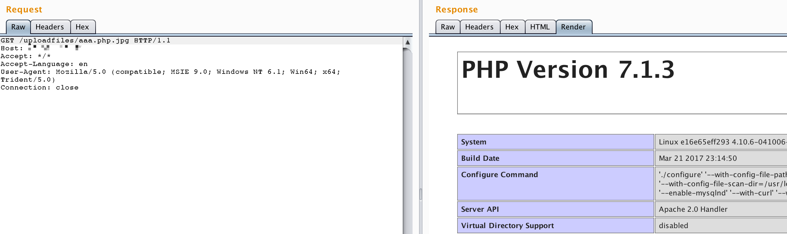

# Apache HTTPD Unknown Suffix Parsing Vulnerability

The environment version:

- PHP 7.x latest version
- Apache HTTPD 2.4.10 stable version (from debian source)

It can be seen that the vulnerability is not related to the Apache and php versions, and is an analysis vulnerability caused by improper user configuration.

Directly execute `docker-compose up -d` to start the container without compiling. After launching, visit `http://your-ip/uploadfiles/apache.php.jpeg` and you will find that phpinfo is executed and the file is parsed into a php script.

`http://your-ip/index.php` is a whitelist checking file suffix upload component, which is not renamed after uploading. We can use the Apache parsing vulnerability to get the shell by uploading a file named `xxx.php.jpg` or `xxx.php.jpeg`.

