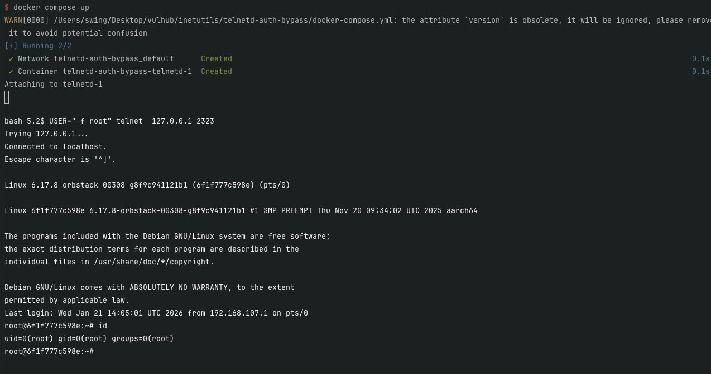

# GNU InetUtils telnetd Remote Authentication Bypass

[中文版本(Chinese version)](README.zh-cn.md)

GNU InetUtils versions 1.9.3 through 2.7 are vulnerable to a remote authentication bypass in the telnetd server. The telnetd server does not sanitize the USER environment variable before passing it to the `login(1)` program. An attacker can supply a crafted USER value like `-froot` to trigger login's authentication-bypass feature (`-f` flag), gaining root access without credentials.

References:

- <https://www.openwall.com/lists/oss-security/2026/01/20/2>

## Vulnerable Environment

Build and run the vulnerable environment:

```bash
docker compose build
docker compose up -d
```

After the service starts, telnetd will be listening on port 2323.

## Vulnerability Exploitation

The vulnerability allows bypassing authentication by injecting the `-f` flag into the USER environment variable. When telnetd receives a username starting with `-f`, it passes this to the login program which interprets `-f` as a flag to skip authentication.

Use the following command to exploit this vulnerability and gain root access:

```bash
USER="-f root" telnet  127.0.0.1 2323
```

After successful exploitation, you will have root shell access without providing any password.


