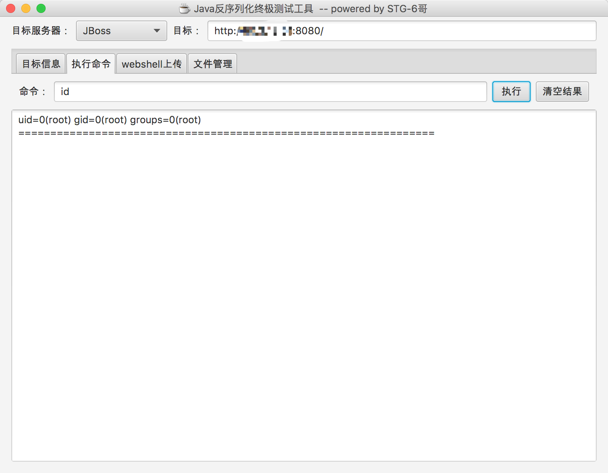

# JBoss JMXInvokerServlet 反序列化漏洞

这是经典的JBoss反序列化漏洞，JBoss在`/invoker/JMXInvokerServlet`请求中读取了用户传入的对象，然后我们利用Apache Commons Collections中的Gadget执行任意代码。

参考文档：

 - https://foxglovesecurity.com/2015/11/06/what-do-weblogic-websphere-jboss-jenkins-opennms-and-your-application-have-in-common-this-vulnerability/
 - https://www.seebug.org/vuldb/ssvid-89723
 - http://www.freebuf.com/sectool/88908.html
 - https://paper.seebug.org/312/

## 漏洞环境

启动漏洞环境

```
docker-compose up -d
```

首次执行时会有1~3分钟时间初始化，初始化完成后访问`http://your-ip:8080/`即可看到JBoss默认页面。

## 漏洞复现

JBoss在处理`/invoker/JMXInvokerServlet`请求的时候读取了对象，所以我们直接将[ysoserial](https://github.com/frohoff/ysoserial)生成好的POC附在POST Body中发送即可。整个过程可参考[jboss/CVE-2017-12149](https://github.com/vulhub/vulhub/tree/master/jboss/CVE-2017-12149)，我就不再赘述。

网上已经有很多EXP了，比如[DeserializeExploit.jar](https://cdn.vulhub.org/deserialization/DeserializeExploit.jar)，直接用该工具执行命令、上传文件即可：


