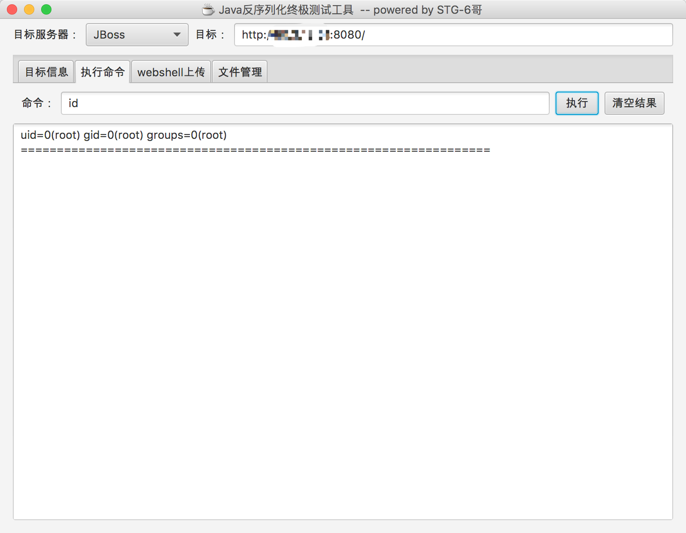

# JBoss JMXInvokerServlet 反序列化漏洞

Red Hat JBoss Application Server 是一款基于 JavaEE 的开源应用服务器。这是经典的 JBoss 反序列化漏洞，JBoss 在 `/invoker/JMXInvokerServlet` 请求中读取了用户传入的对象，然后我们利用 Apache Commons Collections 中的 Gadget 执行任意代码。

参考文档：

 - https://foxglovesecurity.com/2015/11/06/what-do-weblogic-websphere-jboss-jenkins-opennms-and-your-application-have-in-common-this-vulnerability/
 - https://www.seebug.org/vuldb/ssvid-89723
 - http://www.freebuf.com/sectool/88908.html
 - https://paper.seebug.org/312/

## 漏洞环境

执行如下命令启动 JBoss AS 6.1.0：

```
docker compose up -d
```

首次执行时会有 1~3 分钟时间初始化，初始化完成后访问 `http://your-ip:8080/` 即可看到 JBoss 默认页面。

## 漏洞复现

JBoss 在处理 `/invoker/JMXInvokerServlet` 请求的时候读取了对象，所以我们直接将 [ysoserial](https://github.com/frohoff/ysoserial) 生成好的 POC 附在 POST Body 中发送即可。整个过程可参考 [jboss/CVE-2017-12149](https://github.com/vulhub/vulhub/tree/master/jboss/CVE-2017-12149)，我就不再赘述。

网上已经有很多 EXP 了，比如 [DeserializeExploit.jar](https://file.vulhub.org/download/deserialization/DeserializeExploit.jar)，直接用该工具执行命令、上传文件即可：


