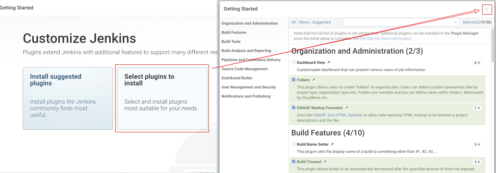

# Jenkins-CI 远程代码执行漏洞（CVE-2017-1000353）

## 原理

参考阅读 https://blogs.securiteam.com/index.php/archives/3171

## 环境搭建

执行如下命令启动jenkins 2.46.1：

```
docker-compose up -d
```

首次运行时会要求填写初始密码，默认在`/var/jenkins_home/secrets/initialAdminPassword`文件中，使用`docker-compose exec jenkins cat /var/jenkins_home/secrets/initialAdminPassword`即可读取。

安装时会让你选择需要安装的插件，我们点击“select plugins to install”，并在接下来的页面点击右上角的关闭按钮，也就是不安装任何插件：



## 测试过程

### 步骤一、生成序列化字符串

下载[CVE-2017-1000353-1.0-SNAPSHOT-all.jar](https://github.com/vulhub/CVE-2017-1000353/releases/download/1.0/CVE-2017-1000353-1.0-SNAPSHOT-all.jar)，这是生成POC文件的工具。

执行下面命令，生成字节码文件：

```bash
java -jar CVE-2017-1000353-1.0-SNAPSHOT-all.jar jenkins_poc.ser "touch /tmp/success"
# jenkins_poc.ser是生成的字节码文件名
# "touch ..."是待执行的任意命令
```

执行上述代码后，生成jenkins_poc.ser文件，这就是序列化字符串。

### 步骤二、发送数据包，执行命令

修改[exploit.py](exploit.py)，一是修改其中的URL为你目标URL，二是修改FILE_SER的文件名为你刚才生成的序列化文件的文件名。

执行（我用的py3成功，py2没测试，可能有BUG）：


进入docker，发现`/tmp/success`成功被创建，说明命令执行漏洞利用成功：


