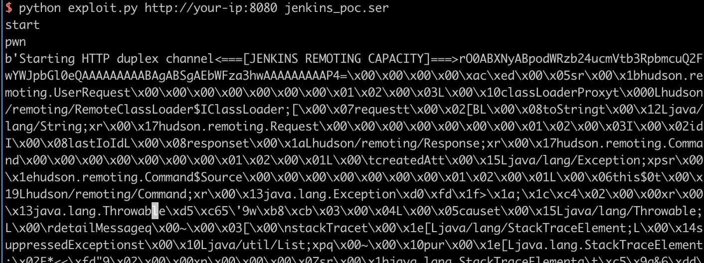

# Jenkins-CI 远程代码执行漏洞（CVE-2017-1000353）

## 原理

参考阅读 https://blogs.securiteam.com/index.php/archives/3171

## 测试环境搭建

测试环境编译及运行：

```
docker-compose build
docker-compose up -d
```

首次运行时会要求填写初始密码，默认在`/var/jenkins_home/secrets/initialAdminPassword`文件中，使用`docker-compose exec jenkins cat /var/jenkins_home/secrets/initialAdminPassword`即可读取。

该漏洞默认环境下即可触发，无需登录，也不用开其他配置。

## 测试过程

### 步骤一、生成序列化字符串

编译payload所需的文件都在payload目录下，主要有如下几种文件：

 - Payload.java 生成Payload的Java文件源码
 - payload.jar 生成完成的Payload
 - *.jar 编译/运行上述源码需要的依赖库
 - exploit.py 将Payload发送到目标的软件

因为我已经编译好了payload.jar，所以无需编译（当然你也可以尝试编译，反正源码都在）。直接执行下面命令，生成字节码文件：

```bash
java -jar payload.jar jenkins_poc.ser "touch /tmp/success"
# jenkins_poc.ser是生成的字节码文件名
# "touch ..."是待执行的任意命令
```

执行上述代码后，生成jenkins_poc.ser文件，这就是序列化字符串。

### 步骤二、发送数据包，执行命令

修改exploit.py，一是修改其中的URL为你目标URL，二是修改FILE_SER的文件名为你刚才生成的序列化文件的文件名。

执行（我用的py3成功，py2没测试，可能有BUG）：



进入docker，发现`/tmp/success`成功被创建，说明命令执行漏洞利用成功：


